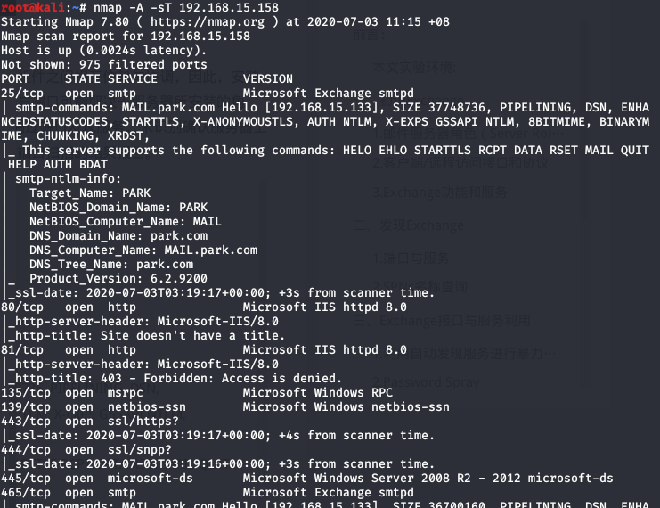
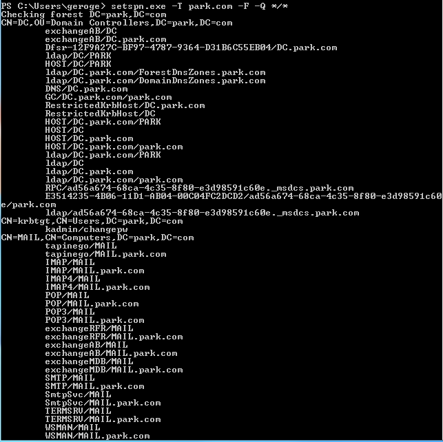

# Exchange

## 一、概述

如维基百科对Exchange  Server的描述，Exchange是由微软推出的用于企业环境中部署的邮件服务器。微软对外发布的第一个Exchange版本是Exchange  4.0，最开始Exchange使用X.400目录服务，随后转向使用微软的活动目录，最开始的时候微软还提供了Microsoft Exchange  Client，即Exchange邮件客户端，随后被Outlook取代，时至今日，微软已经发布了10个大版本号的Exchange，最新版本为Exchange Server 2019。

### 1.1 邮件服务器角色（Server Role）

Exchange Server 2010包含五个服务器角色，分别是邮箱服务器（mailbox server）、集线传输服务器（hub  transport server）、客户端访问服务器（client access server）、边缘传输服务器（edge transport  server）、统一消息服务器（unified messaging  server），除了边缘传输服务器以外其他角色都可以在同一台主机上进行部署添加，其中邮箱服务器、集线传输服务器、客户端访问服务器是核心服务器角色，部署这三个角色就能提供基本的邮件处理功能。

在Exchange Server 2013中，服务器角色精简为三个，分别是邮箱服务器、客户端访问服务器和边缘传输服务器，其中邮箱服务器角色和客户端访问服务器角色通常被安装在同一台服务器中。

在Exchange Server 2016和2019中，只有两种服务器角色，分别是邮箱服务器和边缘传输服务器，所有关键角色和组件都融入到邮箱服务器中。

### 1.2 客户端/远程访问接口和协议

邮件通信分为邮件发送和邮件接收，其中邮件发送使用统一的通信协议，即SMTP，而邮件的收取则有多种协议标准，如POP3、IMAP等等，下面介绍Exchange提供支持的访问接口和协议。

**Outlook Web App（OWA）**

Exchange提供的Web邮箱，地址通常为 http://DOAMIN/owa/

**Exchange Administrative Center（ECP）**

Exchange管理中心，管理员用于管理组织中的Exchange的Web控制台，地址通常为 http://DOMAIN/ecp/

**Outlook Anywhere（RPC-over-HTTP，RPC/HTTP）**

外网用户可以直接通过Outlook  Anywhere连接使用Exchange邮箱而无需使用VPN，内网用户则通过RPC协议连接使用Exchange。从Exchange     2013开始，Outlook不再区分内外网环境，统一使用Outlook Anywhere，同时，不需要开放单独的RPC端口。Outlook  Anywhere在Exchange Server 2013中默认开启。

**MAPI（MAPI-over-HTTP，MAPI/HTTP）**

一种Outlook与Exchange交互的新的传输协议，于Exchange 2013 SP1和Outlook 2013 SP1中被提出。

**Exchange ActiveSync（EAS，XML/HTTP）**

ActiveSync是一种允许用户通过移动设备或其他便携式设备访问和管理邮件、联系人、日历等Exchange功能的同步协议，在Windows上使用时其进程名称为wcesomm.exe。

**Exchange Web Service（EWS，SOAP-over-HTTP）**

Exchange提供了一套API编程接口可供开发者调用，用于访问Exchange服务器，与邮件、联系人、日历等功能进行交互和管理操作，在Exchange Server 2007中被提出。微软基于标准的Web Service开发EWS，EWS实现的客户端与服务端之间通过基于HTTP的SOAP交互。

## 二、发现Exchange

### 2.1 端口与服务

`nmap -A -sT 192.168.15.158`



### 2.2 SPN名称查询

SPN（Service Principal  Name），是Kerberos认证中不可缺少的，每一个启用Kerberos认证的服务都拥有一个SPN，如文件共享服务的SPN为cifs/domain_name，LDAP服务的SPN为ldap/domain_name，在Kerberos认证过程，客户端通过指定SPN让KDC知晓客户端请求访问的是哪个具体服务，并使用该服务对应的服务账号的密钥来对最终票据进行加密。关于Kerberos和SPN的更多信息不在此展开讲，有兴趣的同学可以自行查阅资料。

除了端口扫描之外，对于熟悉内网渗透的同学来说，通过SPN来发现服务应该也是必备伎俩了，这种方法在Windows环境中尤其有效，因为其不需要与各个主机进行通信，而是通过已有的普通用户权限，查询活动目录数据库，枚举得到SPN，从而获知各个主机上运行着哪些服务应用。

`setspn.exe -T park.com -F -Q */*`



## 三、口令猜解

### 3.1 利用自动发现服务进行暴力破解

访问http://192.168.15.158/Autodiscover/Autodiscover.xml 文件需要认证，利用该接口可以进行暴力破解（工具是ruler）

### 3.2 password spray

password spray同样是一种破解账户密码的方法，与常规的暴力破解方法不同的是，password  spary针对一批账户进行破解，每次对单个用户账户进行一次或少数次登陆尝试后换用下一个用户进行尝试，如此反复进行并间隔一定时间，以此方法躲避多次暴力破解的检测和账户锁定的风险。

mailsniper提供分别针对OWA接口、EWS接口和ActiveSync接口的password spray。

## 四、取得合法凭证后渗透

### 4.1 滥用Outlook功能getshell

**规则和通知功能的滥用**

Outlook提供了一项 ”规则和通知“ （Rules and  Alerts）的功能，可以设置邮件接收和发送的策略，分为规则条件和动作，即用户定义当邮件满足某些条件时（如邮件主题包含特定词语），触发一个特定的动作，这个动作可以是对邮件的管理、处置，甚至是启动应用程序。

**主页设置功能的滥用**

在Outlook中，提供了一个功能允许用户在使用Outlook的时候设置收件箱界面的主页，可以通过收件箱的属性来设置加载外部URL，渲染收件箱界面。收件箱主页URL作为收件箱的设置属性，会在客户端Outlook和Exchange服务端之间进行同步，而通过MAPI/HTTP协议与Exchange服务端的交互，可以直接设置该属性。因此，当已拥有合法邮箱凭证的前提下，可以利用该功能，为邮箱用户设置收件箱主页URL属性，将其指向包含恶意代码的页面，当用户在Outlook中浏览刷新收件箱时，将触发加载恶意页面，执行恶意脚本代码，形成远程命令执行。

### 4.2 检索邮件内容

[MailSniper][https://github.com/dafthack/MailSniper]可以被用户或管理员用于检索查找自己邮箱和文件夹信息，而攻击者利用该工具，也可以在获得合法邮箱凭证之后，通过检索邮箱文件夹来尝试发现和窃取包含敏感信息的邮件数据。Mailsniper包含两个主要的cmdlet，分别是Invoke-SelfSearch和Invoke-GlobalMailSearch，用于检索邮件中的关键字。

### 获取域内所有邮箱用户列表

```
powershell -exec bypass
Import-Module ./MailSniper.ps1
Get-GlobalAddressList -ExchHostname 192.168.15.158 -UserName park\geroge -Password "12345"
```

