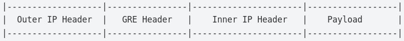
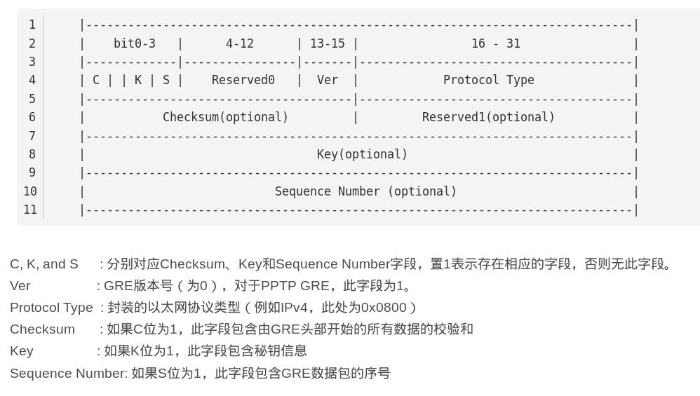
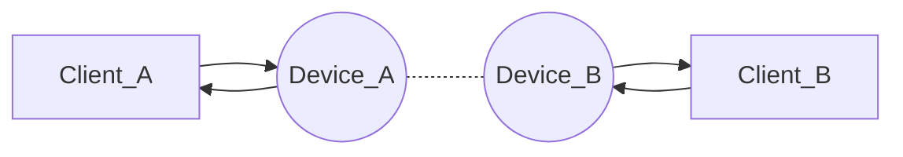
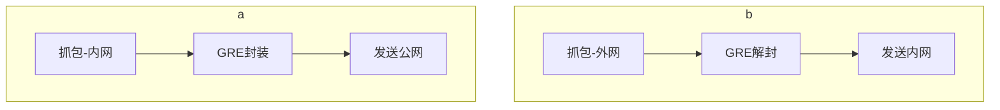

# GRE封装

## 定义

 GRE（Generic Routing Encapsulation，通用路由封装）协议是对某些网络层协议（如IP 和IPX）的数据报文进行封装，使这些被封装的数据报文能够在另一个网络层协议（如IP）中传输。

当 GRE 包被封装在 IPv4 中时，需要使用 IPv4 协议 47 。

GRE Header格式

## 实现

Client_A位于子网192.168.100.1/24，Client_B位于子网192.168.200.1/24，Device_A和Device_B各有两张网卡（一张公网网卡和一张内网网卡）。Client_A和Client_B无法直接通信，需在他们之间使用GRE封装技术搭建通道。

GRE模块需要对从内网网卡出去的数据进行封装发送给另一端的GRE模块解封，并对从公网网卡收到的GRE封装数据进行解封，再发送给内网目的终端。

由于GRE封装需要在原有IP数据前面添加新的IP头和GRE头，GRE封装后的IP数据包长度可能会超过MTU，因此GRE模块需要支持IP分片技术。

TSO (TCP Segmentation Offload) 是一种利用网卡替代CPU对大数据包进行分片，降低CPU负载的技术。TSO 是使得网络协议栈能够将大块 buffer 推送至网卡，然后网卡执行分片工作，这样减轻了CPU的负荷，其本质实际是延缓分片。当网卡支持TSO技术时，Socket会抓到长度大于MTU的TCP数据报，因为TCP协议不支持IP分片，因而只能一份长的TCP数据报拆分为多份短的TCP数据报。

处理流程如下：

linux对应windows头文件转换

arpa/inet.h*在*windows*下*对应什么文件

windows的总库包含了上述内容：

\#include <windows.h>

\#pragma comment(lib, "wsock32.lib")

就可以了

windows平台下: 头文件#include<ws2tcpip.h>

linux平台下： 下面两个头文件都有定义： 
`#include <sys/socket.h> ` 

`#include<unistd.h> `

 #include <netinet/in.h> #include <netdb.h>

vc下把这个包含语句改为 
\#include <winsock2.h>
\#pragma  comment(lib,"ws2_32.lib")

