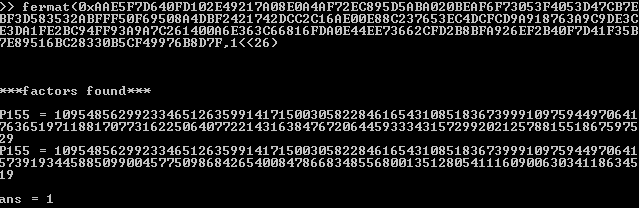
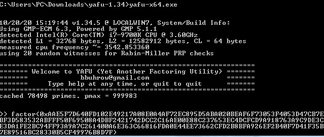

# RSA攻击方法总结

## 概要

RSA是一种非对称加密算法，非常普遍，主要涉及的数学知识：欧拉函数、欧拉定理。

## 数学基础

### 欧拉函数

对于给定正整数n，小于等于n的所有正整数中，欧拉函数求解求解出有多少个与n互质，记为$\phi(n)$。

+ 若$n$为素数，$\phi(n) = n-1$
+ 若$n$为两个素数$p,q$的乘积，$phi(n)=\phi(p)\times\phi(q)$

### 欧拉定理

如果两个正整数$a$和$n$互质，则$n$的欧拉函数$\phi(n)$满足下列等式 
$$
a^{\phi(n)}\equiv1\pmod{n} \tag{1}
$$

## RSA加解密过程

RSA算法的关键是需要生成公钥和密钥；

1. 选择两个大素数$p$和$q$，$n = p \times q$；
2. 则$n$的欧拉函数$\phi(n) = (p - 1) (q - 1)$。（由[费马小定理](https://baike.so.com/doc/5743090-5955843.html)容易证明）。
3. 设RSA算法的公钥为$e$，私钥为$d$，选择**较小素数**$e$，保证 $1 < e < \phi(n)$, $gcd(e,\phi(n)) = 1$，由式子：$ed \equiv 1 \pmod {\phi(n)}$，计算私钥$d$的值；
4. 公开$n$，$e$的值，保留$p$，$q$，$d$的值。即完成RSA密钥生成的过程；
5. 加密时：设明文为$m$，密文为$c$，则$c \equiv m^e \pmod {n}$;
6. 解密时：$m \equiv c^d \pmod {n}$，即可完成解密。

## RSA攻击方法

### 分解大整数

+ 费马分解法

  当大整数$n$两个因子$p$和$q$非常接近时，可以通过费马分解法快速分解大整数。费马分解法主要是找到两个整数$a,b$满足$a^2-b^2=n$，通过计算$gcd(a+b,n)$可以对$n$进行分解。

  ```python
  # sage code 
  def factor_fermat(n,B)
      a = int(n.sqrt(prec=1000))
      b = int((a*a-n).sqrt(prec=1000))
      i = 0
      while i < B:
          if b*b == (a*a - n):
              return gcd(a+b,n)
          a = a+1
          b = int((a*a-n).sqrt(prec=1000))
          i = i+1
      return -1
  ```

  大数分解神器yafu中的feimat算法效率特别高，先看一下yafu中对fermat的介绍

  > help(fermat)
  >
  > searching for help on '(fermat)'
  > usage: fermat(expression1,expression2)
  >
  > description:
  > performs the fermat factorization algorithm on expression1, using a maximum of
  > expression2 iterations.

  用自己编写的fermat算法分解0xAAE5F7D640FD102E49217A08E0A4AF72EC895D5ABA020BEAF6F73053F4053D47CB7EBF3D583532ABFFF50F69508A4DBF2421742DCC2C16AE00E88C237653EC4DCFCD9A918763A9C9DE3CE3DA1FE2BC94FF93A9A7C261400A6E363C66816FDA0E44EE73662CFD2B8BFA926EF2B40F7D41F35B7E89516BC28330B5CF49976B8D7F巨慢，yafu几乎秒出结果，话不多说，直接上图

  

+ Pollard p-1

  这种方法是在p-1的素数分解式中不含有大于预定B值的素因数的情况下，找到一个基本的素数p，求出一个数的素因数。方法有点特殊，它只能应用在求整数n的一个素因子p，且p-1能被“小”因子整除的情况下，除此之外该方法无法正常应用。

  ```python
  # sage code
  def factor_p_1(n,B):
      a = 2
      for i in range(2,B):
          a = power_mod(a,i,n)
          p = gcd(a-1,n)
          if p>1 and p<n；
              return p
      return -1
  ```

+ yafu

  yafu使用最强大的现代算法去自动化的分解输入的整数。大多数的算法都实现了多线程，让yafu能充分利用多核处理器（算法包括 SNFS, GNFS, SIQS, 和 ECM）。不明觉厉

  

+ factordb

  如果对一个大整数用一些特殊算法也分解不了的时候，我们可以在 http://factordb.com/ 中查询一下数据库，说不定就能找到其因子

+ 小解密指数

  当 d < (1/3) N^(1/4)时，我们可以通过Wiener's attack分解得到d；当d满足 d ≤ N^0.292 时，我们可以利用该方法分解N，理论上比wiener attack要强一些。得到$e,d$后即可分解$N$

### 共模攻击

使用相同的模数$N$ 、不同的公钥$e_1,e_2$，加密同一明文消息$m$。

```python
# sage code
def dec_same_N_m(N,e1,C1,e2,C2):
    d,u,v = xgcd(e1,e2)
    if d!= 1:         # e1,e2均为素数，应该互素
        return -1
    return Mod(power_mod(C1,u,N)*power_mod(C2,v,N),N)
```

### 小公钥指数攻击

当e十分小时，比如e等于3，5，7，11时，使用coppersmith方法求明文。

### 模不互素

两个公钥的N不互素时，通过gcd进行分解