# 被动信息收集

## DNS信息

`nslookup`可以执行dns查询

`type=a | ns | ptr | mx` 设置查询类型

### dig

1. `dig 163.com`  查询163.com域下的A记录（默认查询A记录）

   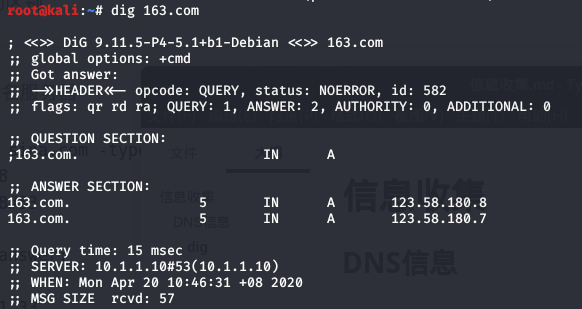

2. `dig 163.com any @8.8.8.8`

   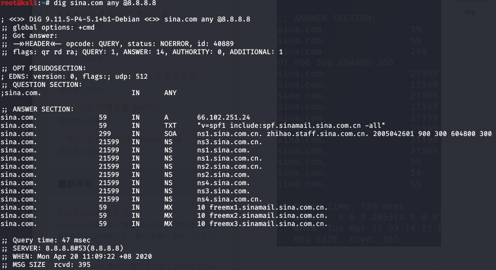

   `any`表示查询类型，还可以是`MX`，`NS`等等

   `@8.8.8.8`表示设置DNS服务器，默认采用本地DNS服务器，测试时发现本地DNS服务器对于any类型的查询没有反应。

   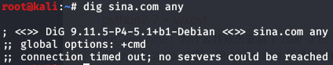

3. 反向查询`dig -x 66.102.251.24`

   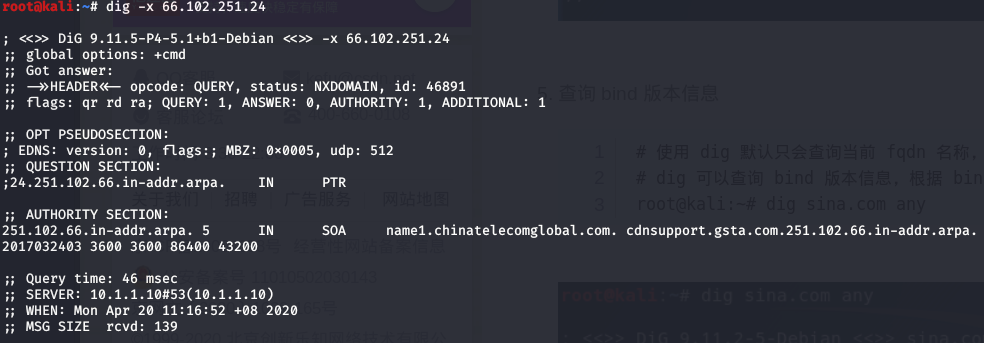

   从反向查询结果看，没看出什么信息。

4. 查询bind版本信息

   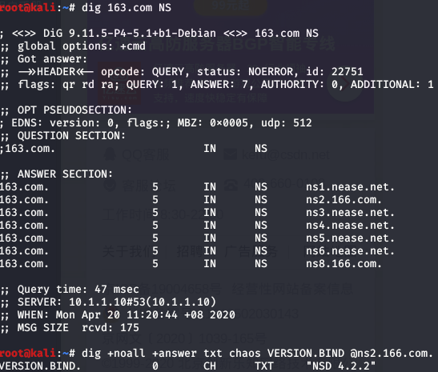

5. DNS追踪

   跟踪过程：直接迭代查询，不经过本地缓存域名0服务器（从根域开始）

   `dig +trace www.163.com`

### 区域传输

在本域的各个域名服务器之间进行信息同步，不安全的配置会允许任意终端获取到域名服务器上的全部域名信息。

`dig @ns1.nease.net. 163.com axfr` 连接失败。

### DNS信息枚举

1. dnsenum

   `dnsenum -f dnsenum.txt -dnsserver 8.8.8.8 sina.com -o sina.xml`

   `dnsenum --enum sina.com`

2. dnsdict6 安装较为复杂，没有尝试。

3. msfconsole | `use auxiliary/gather/enum_dns` | `set DOMAIN 163.com` | `set THREADS 10` | `run` 功能异常强大，方便好用

4. 

### DNS注册信息

`whois sina.com`查询域名注册信息

## SNMP信息收集

简单网络管理协议（SNMP）是TCP／IP协议簇的一个应用层协议，工作在UDP 161端口，用于监控目标设备的操作系统、硬件设备、服务应用、软硬件配置、网络协议状态、设备性能及资源利用率、设备报错事件信息、应用程序状态等软硬件信息。

### windows下SNMP安装

1. 控制面板，打开或关闭windows功能，安装SNMP协议；
2. 在服务中，找到SNMP server，右键属性 | 安全 | 添加，社区名称public，添加SNMP查询的主机ip地址（kali的ip地址）。

### snmp-check

snmp-check通过发送各种预定义的OID对目标进行探测，收集目标SNMP管理的信息。

`snmp-check 10.1.1.23 -c public -v 1`

可以得到目标的服务、端口、软件、硬件等等信息

### snmpwalk

`snmpwalk -c public 10.1.1.23 -v 2c` 查询snmp信息，结果显示方式不够人性化。没有snmp-check好用。

## 搜索引擎

### shodan

一个可以搜索联网设备的强大引擎。

官网：https://www.shodan.io

+ 8.8.8.8
+ net: 8.8.8.8/24
+ country : US
+ city: Beijing
+ port: 80, 81
+ os: linux
+ hostname: www.baidu.com
+ user:admin pass:password
+ linux upnp axtech（搜索网络摄像头）

msf
```
msf5 > use auxiliary/gather/shodan_search 
msf5 auxiliary(gather/shodan_search) > set QUERY hostname:packtpub.com //设置目标机器
QUERY => hostname:packtpub.com
msf5 auxiliary(gather/shodan_search) > set SHODAN_APIKEY SDaE*******ABKTxJ3 //设置shodan api key
SHODAN_APIKEY => SDaEijF******dudxCABKTxJ3
msf5 auxiliary(gather/shodan_search) > run
```


### 谷歌

+ +支付 -充值
+ “支付充值”
+ intitle: 电子商务 intext:法人 intext:电话 //标题含有电子商务，正文含有法人和电话
+ site:alibaba.com inurl:contact //url含有contact
+ SOX filetype:pdf
+ inurl: "level/15/exec-/show"
+ https://www.exploit-db.com/google-hacking-database 详细介绍了谷歌搜索语法

## SMTP用户枚举

若邮件服务器未禁用MAIL FROM、RCPT TO、ETRN、VRFY指令，则可以利用这些特殊命令枚举用户。

| SMTP命令  | 命令功能                                                     |
| --------- | ------------------------------------------------------------ |
| MAIL FROM | 指定发件人地址                                               |
| RCPT TO   | 指定单个的邮件接收人；可有多个 RCPT TO；常在 MAIL FROM命令之后 |
| VRFY      | 用于验证指定的用户/邮箱是否存在；由于安全原因，服务器常禁止此命令 |
| EXPN      | 验证给定的邮箱列表是否存在，也常被禁用                       |

执行上面的SMTP命令，通过其返回码可以判断用户是否存在。主要是250和550状态。

| 返回码 | 含义                                                         |
| ------ | ------------------------------------------------------------ |
| 250    | 要求的邮件操作完成                                           |
| 550    | 要求的邮件操作未完成，邮箱不可用（例如，邮箱未找到，或不可访问） |

通过上面的介绍，我们可以通过Telnet连接，在未禁用上述SMTP命令的服务器上，使用上述命令手动枚举用户名。通过shodan等可以找到开放SMTP的服务器。

metasploit有辅助模块smtp_enum,可以基于字典枚举smtp用户名。设置比较简单，主要是常规的远程主机地址、端口号、用户名字典、线程数等。其中的UNIXONLY是用于设置是否跳过对微软系的测试，这是由于Windows的SMTP服务命令稍有不同

`set rhosts 202.38.xxx.xxx`

## CUPP用户字典生成

按个人信息生成其专属的密码字典

```
git clone https://github.com/Mebus/cupp.git
python cupp.py -i
```

## 图片信息

exif (linux)

## recon-ng

Recon-ng是用Python编写的功能齐全的Web侦察框架。具有独立模块，数据库交互功能和内置的便捷功能。

**Recon-ng 5没有模块，这也是主要区别之一。此外，参数，命令等已与以前的版本稍有不同。**

`recon-ng`启动recon-ng

`help` 查看命令帮助信息

`command 2次[Tab]` 提示该命令支持的参数，根据参数基本可以了解该命令的使用方法。

`options list` 查看选项信息

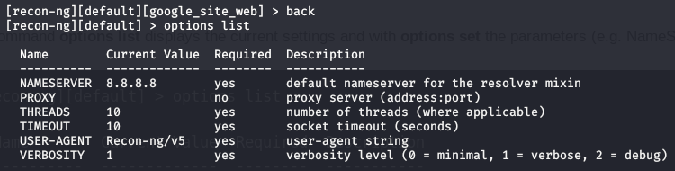

`options set PROXY 127.0.0.1:9150` 试图设置tor作为代理，提示代理错误

安装模块，需要翻墙。marketplaces可以理解为应用商店

```
marketplaces refresh
marketplaces install all
```

modules用于加载应用模块

```
modules search ""
modules load ""
```

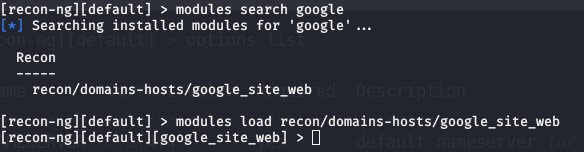

加载模块后，首先使用`info`查看模块信息

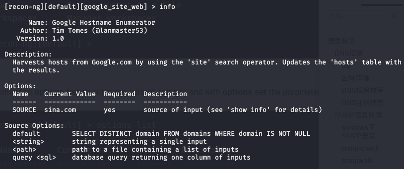

再使用`options set SOURCE sina.com`设置模块需要的参数

最后执行`run`

结果存在hosts数据库中，通过`show hosts`查看结果，也可以用`db query select * from hosts`执行sql查询。

可以利用上述方法了解掌握他模块的使用方法。

# 主机发现-链路层

## arping

arping主要干的活就是查看ip的MAC地址及IP占用的问题。

`arping 10.1.1.23 -c 2`发送两个arp请求包，询问10.1.1.23的MAC地址。

`arping 10.1.1.23 -d`发现网络中是否存在arp欺骗。

```bash
#!/bin/bash
if [ $# -ne 1 ];then
        echo "usage: arp_find.sh [network]"
        echo "example: arp_find.sh 192.168.2.100/24"
        echo "example will perform arp scan for the network 192.168.2.100/24"
        exit
fi

network=$1
#echo $network
ip1=$(echo $network | cut -d '/' -f 1 | cut -d '.' -f 1)
ip2=$(echo $network | cut -d '/' -f 1 | cut -d '.' -f 2)
ip3=$(echo $network | cut -d '/' -f 1 | cut -d '.' -f 3)
ip4=$(echo $network | cut -d '/' -f 1 | cut -d '.' -f 4)
let "ip_num=($ip1<<24)+($ip2<<16)+($ip3<<8)+$ip4"
mask=$(echo $network | cut -d '/' -f 2)
let "ip_num=$ip_num&((1<<32)-(1<<(32-mask)))"
let "count=1<<(32-$mask)"
for i in $(seq 1 $count);do
        let "ip_num=$ip_num+1"
        let "ip_tmp=(($ip_num>>24)&((0xFF)))"
        ip=$ip_tmp
        let "ip_tmp=(($ip_num>>16)&((0xFF)))"
        ip=$ip.$ip_tmp
        let "ip_tmp=(($ip_num>>8)&((0xFF)))"
        ip=$ip.$ip_tmp
        let "ip_tmp=(($ip_num>>0)&((0xFF)))"
        ip=$ip.$ip_tmp
        arping $ip -c 1 | grep 'bytes from' | cut -d ' ' -f 5 | cut -d '(' -f 2 | cut -d ')' -f 1
done
```


## nmap

只进行主机扫描，不扫描端口。

`nmap -sn 10.1.1.20/24` -sn在帮助信息中描述为ping扫描，针对局域网内ip其实是arp扫描。

`namp -sn 10.1.1-2.20-30`

`nmap -iL filename -sn`扫描文件中的ip列表

对于同一个子网ip，采用arp扫面；对于其他子网ip，采用ping和tcp扫描。

`nmap -sn 192.168.2.185`

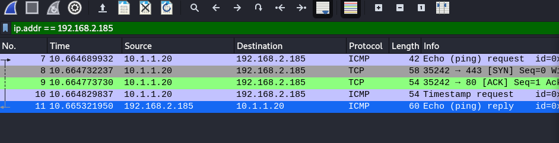

## netdiscover

支持主动arp发现和**被动**arp发现。

`netdiscover -i eth0 -r 10.1.1.20/24`

`netdiscover -l filename`

`netdiscover -p`被动arp扫描

## scapy

scapy在python3.8下会报错

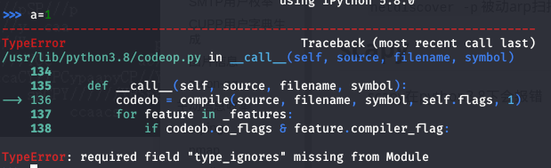

查了不少资料，未找到解决办法，后来在/usr/bin/中找到了scapy2文件夹，可以正确执行。

```
scapy
>>> arp=ARP()
>>> arp.pdst="10.1.1.23"
>>> sr1(arp)
Begin emission:
*Finished sending 1 packets.

Received 1 packets, got 1 answers, remaining 0 packets
<ARP  hwtype=0x1 ptype=IPv4 hwlen=6 plen=4 op=is-at hwsrc=00:0c:29:d4:97:5c psrc=10.1.1.23 hwdst=00:0c:29:fc:75:6a pdst=10.1.1.20 |<Padding  load='\x00\x00\x00\x00\x00\x00\x00\x00\x00\x00\x00\x00\x00\x00\x00\x00\x00\x00' |>>
```

启动scapy，执行arp发现。

`sr1(arp,timeout=1)`当目标ip不是活跃主机时，scapy的arp发现功能将持续分析网卡上的流量，设置超时时间是正确的做法。

## metasploite

+ arp_sweep

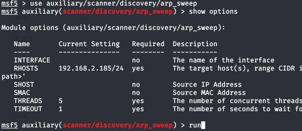

  只能用于发现本地局域网内的主机，因为该模块只发送arp请求包。

+ arp_scanner

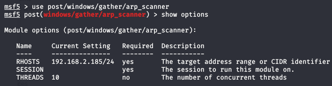

没有查到session参数如何设置，暂不会使用。

# 主机发现-网络层

**基本原理**
发送ICMP ECHO，存活主机响应ICMP REPLY

## ping

`ping 192.168.2.185 -c 4`发送4个ICMP ping 包，linux下ping命令会无限ping目标主机。

ICMP发现的成功有很多条件，显得不是很可靠。

`ping -R www.sina.com`   帮助信息显示为record route记录路由，实际执行没有反应，wireshark抓包显示icmp的TTL值为64，不清楚为何这样。

## scapy

`ping_rep = sr1(IP(dst="192.168.2.185")/ICMP(),timeout=1)`

## nmap

详见链路层信息收集

## fping

类似于著名的 ping 工具，它也内建了在 ping 中不存在的许多附加功能。

`fping 192.168.2.185`

与标准 ping 工具不同, fping 会在收到单个应答后停止发送 ICMP 回显请求。使用`-c count`修改默认尝试连接次数。

`fping -g 192.168.2.185 192.168.2.200`

`fping -g 192.168.2.185/24`

`fping -f iplist.txt`

## hping3

`hping3 192.168.2.36 --icmp -c 2`

# 主机发现-运输层

**基本原理**
+ 发送TCP-ACK封包，活动主机会响应TCP-RST封包
+ 发送UDP封包，如果目标主机的端口未打开，会响应ICMP端口不可达。

## scapy

**TCP**

`rep=sr1(IP(dst='192.168.2.111')/TCP(dport=80,flags='A'))`

正常情况下，向活动主机的任意端口发送未建立连接的TCP-ACK报，目标主机均返回RST报；如果目标主机不存在，则不会收到响应，因此可以用来实现主机发现。

实际测试中从NAT设备后面的主机向NAT设备外面的主机发送TCP-ACK报，有时会得到相响应，有时不会，在目标主机上抓包也未发现发送的TCP-ACK报，猜测虚拟机虚拟的NAT设备拦截了未建立连接的TCP-ACK报，并可能会回TCP-RST报。

同理测试small wall防火墙，发现未建立连接的TCP-ACK报被防火墙拦截，但并不会作出响应。

**UDP**

`rep=sr1(IP(dst='192.168.2.106')/UDP(dport=137),timeout=2,verbose=1)`

测试发现，目标机器并不会响应我们发送的UDP报，这是因为目标主机通常被配置为仅响应包含特定内容的请求。

## nmap

**UDP**

`nmap 192.168.2.106 -PU137 -sn`

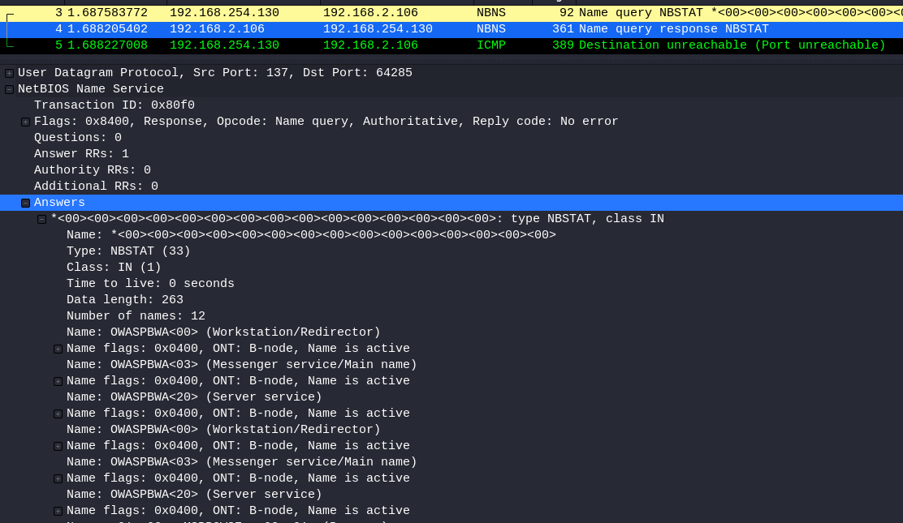

nmap扫描UDP137端口时，会附加应用层数据（NBNS协议），如果目标主机是活动的，会予以响应，可以用来实现主机发现。

`nmap 192.168.2.1-255 -PU137 -sn`

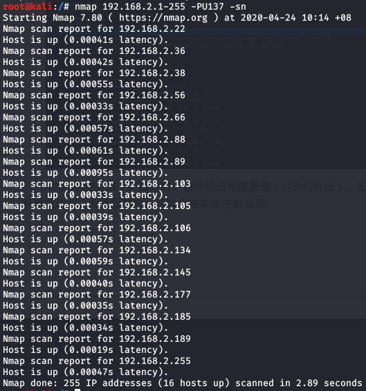

nmap扫描UDP53端口（DNS服务），请求报中未指定请求内容，一般只有DNS服务器会响应not implemented，然后扫描方会回复端口不可达（与UDP137扫描类似，这个ICMP包应该是操作系统回复的，因为在系统并不知道前一个DNS request报，因此系统认为DNS response报是莫名其妙出现的）。

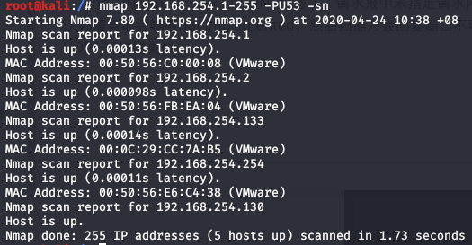

实际测试中发现了多个主机，这些主机位于LAN，在发送DNS请求报前会进行ARP请求，因此这些主机是由ARP扫描发现的。当扫描非局域网主机时，不一定会得到响应。

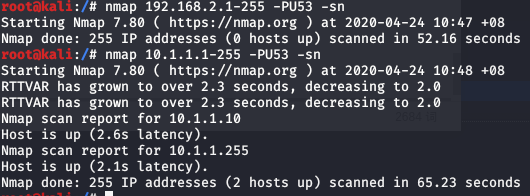

**nmapTCP-ACK扫描的情形与scapy的TCP-ACK扫描原理、结果一样，NAT设备拦截未建立连接的TCP-ACK报并回应TCP-RST报，smallwall设备仅拦截TCP-ACK报**

**nmap的UDP扫描比scapy的UDP扫描智能一些，会自动添加应用层信息实测UDP137端口扫描的结果是准确的**

## hping3

`hping3 192.168.254.133 --udp -c 2`默认向UDP 0端口发送UDP报，不一定会有响应。原因是因为不同的路由器、防火墙对于ICMP端口不可达数据包的处理规则不同，可能会拦截，因此可能会得不到响应。

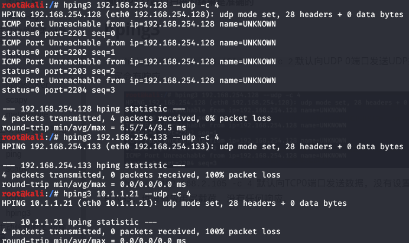

`hping3 192.168.2.105 -c 4` 默认向TCP0端口发送数据，没有设置FLAGS，也没有应用层载荷，应该会得到TCP-RST_ACK报，不过也可能不会得到响应，原因应该是中间设备（路由器或防火墙）对于没有flags的TCP报进行了拦截丢弃。

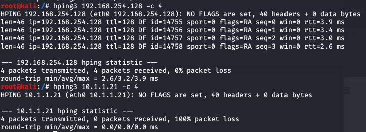

# 端口扫描

端口扫描的前提是已知活动的目标主机。

## UDP端口扫描

**基本原理**

+ 扫描未绑定任何服务的UDP端口，设备默认响应ICMP端口不可达，不返回这种响应代表存在这种服务，该方法生效依赖于主机生成端口不可达响应并且端口不可达响应不会被防火墙拦截。
+ 使用服务特定的探针尝试请求响应，以表明预期服务运行于目标端口上，该方法非常高效，也非常耗时。

### scapy

`rep=sr1(IP(dst='192.168.2.105')/UDP(dport=53), timeout=2)`

### nmap

`nmap 192.168.254.128 -sU` 默认扫描1000个端口，基于ICMP端口不可达判定

`nmap 192.168.254.128 -sU -p 53` 指定扫描UDP53端口

`nmap 192.168.254.128 -sU -p 1-100`

### metasploit

使用scanner/discovery/udp_sweep，从wireshark抓包来看仅仅测试了几个常用端口，并未完全测试，结果不准确。

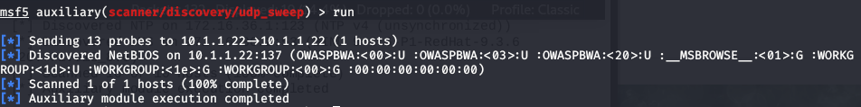

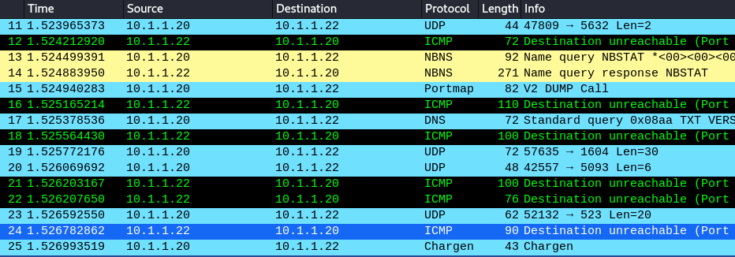

## TCP端口扫描

**基本原理**

+ 连接扫描，为每个扫描端口建立完整的TCP连接，如果连接成功建立，端口可以判断为打开的。
+ 隐秘扫描，为每个扫描端口发送SYN封包，收到ACK+SYN封包后判定端口是开放的，不再发送最后的ACK，便没有建立完整的连接，目标机器的日志系统不会记录这种扫描的痕迹。
+ 僵尸扫描
  - 某台主机的ip序列号的生成方式是加1，且不与其他网络系统交互，称之为僵尸系统。
  - 首先，向僵尸系统发送SYN+ACK封包，获取返回RST封包中的ip序列号id1；
  - 其次，向远程系统的目标端口发送SYN封包，封包的源地址设置为僵尸系统的IP地址；
  - 最后，向僵尸系统发送SYN+ACK封包，获取返回RST封包中的IP序列号id2；
  - 如果远程系统的目标端口是打开的，在其收到SYN封包后，会向僵尸系统返回SYN+ACK封包，继而僵尸系统回向远程系统返回RST封包，ip序列号加1；如果远程系统的目标端口是关闭的，在其收到SYN封包后回向僵尸网络返回RST封包，僵尸网络不会对RST封包作出任何响应。因而如果id2-id1的值为2，则意味着目标端口是开放的，反之为1，则意味着目标端口是关闭的。

### scapy

**隐匿扫描**

`rep=sr1(IP(dst='192.168.2.105')/TCP(dport=80))`

发送SYN封包给远程系统的目标端口，如果返回SYN+ACK响应，可以判定这个端口开放，如果返回RST封包，表明端口关闭。

**连接扫描**

scapy 难以执行TCP完全连接扫描，因为系统内核并不知scapy发送的请求，因而当系统收到来自远程系统的SYN+ACK响应时，系统内核会使用RST回复，从而断开连接。

只有修改iptables，阻塞系统发出的所有RST响应，可以使得scapy完成TCP连接建立。

`iptables -A OUTPUT -t filter -d 10.1.1.22 -p tcp --tcp-flags RST RST -j DROP` 在iptables中OUTPUT链上过滤发向10.1.1.22的TCP-RST封包并丢弃。

```python
#!/usr/bin/python

import logging
logging.getLogger("scapy.runtime").setLevel(logging.ERROR)
from scapy.all import *

response = sr1(IP(dst='10.1.1.22')/TCP(dport=80,flags='S'))
reply = sr1(IP(dst='10.1.1.22')/TCP(dport=80,flags='A',seq=(response[TCP].ack),ack=(response[TCP].seq+1)))
```


从wireshark抓包中可以看出，TCP连接正常建立起来了。值得注意的是脚本中ACK确认封包的ack,seq字段须被设置。

**僵尸扫描**


### nmap

**隐匿扫描**

`nmap 10.1.1.22 -sS`扫描nmap定义的1000个常用端口

`nmap 10.1.1.22 -sS -p 24,80,443` 指定扫描TCP端口

`nmap 10.1.1.22 -sS -p 1-1000`

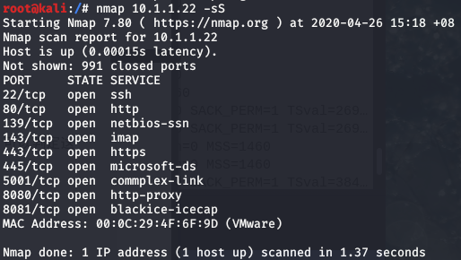

**连接扫描**

`nmap 10.1.1.22 -sT`与`-sS`的区别是：`-sT`发送SYN，收到SYN-ACK后再回ACK封包，但`-sS`不再回ACK

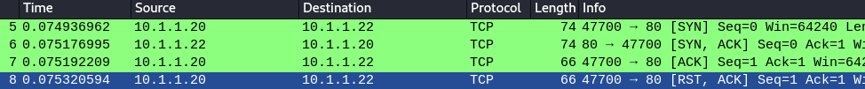

**僵尸扫描**

使用metasploit中auxiliary/scanner/ip/ipidseq模块判断远程系统ip包序号的变化方式。

`nmap 10.1.1.22 -sI 10.1.1.21 -Pn -p 0-100`

+ `-sI` 传入僵尸系统的IP地址，并执行僵尸扫描

+ `-Pn` 相信远程系统是活跃的，阻止nmap使用ping扫描远程系统。

由于kali虚拟机的ip序列号固定不便，没有尝试僵尸扫描。

### metasploit

**隐匿扫描**

```
msf5 > use auxiliary/scanner/portscan/syn
msf5 auxiliary(scanner/portscan/syn) > set RHOSTS 10.1.1.22
msf5 auxiliary(scanner/portscan/syn) > set threads 20
msf5 auxiliary(scanner/portscan/syn) > set ports 1-1000
msf5 auxiliary(scanner/portscan/syn) > run

[+]  TCP OPEN 10.1.1.22:22
[+]  TCP OPEN 10.1.1.22:80
[+]  TCP OPEN 10.1.1.22:139
[+]  TCP OPEN 10.1.1.22:143
[+]  TCP OPEN 10.1.1.22:443
[+]  TCP OPEN 10.1.1.22:445
[*] Scanned 1 of 1 hosts (100% complete)
[*] Auxiliary module execution completed
```

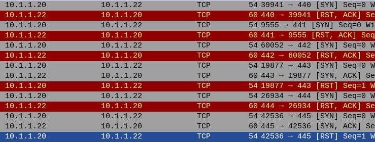

syn模块仅发送SYN封包

**连接扫描**

```
msf5 > use auxiliary/scanner/portscan/tcp
msf5 auxiliary(scanner/portscan/tcp) > set rhosts 10.1.1.22
msf5 auxiliary(scanner/portscan/tcp) > set ports 80,440-445
msf5 auxiliary(scanner/portscan/tcp) > run

[+] 10.1.1.22:            - 10.1.1.22:443 - TCP OPEN
[+] 10.1.1.22:            - 10.1.1.22:80 - TCP OPEN
[+] 10.1.1.22:            - 10.1.1.22:445 - TCP OPEN
[*] 10.1.1.22:            - Scanned 1 of 1 hosts (100% complete)
[*] Auxiliary module execution completed

```

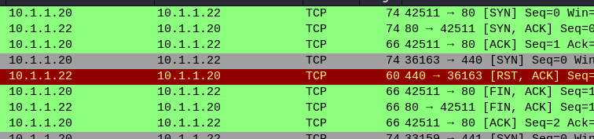

tcp模块实现了完整的TCP连接

### hping3

`hping3 10.1.1.22 --scan 80,443,445 -S`

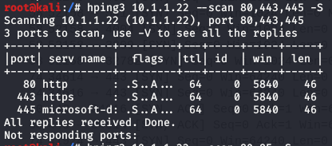

-S 选项指明了发给远程系统的封包中激活的 TCP 标识。表格展示了接收到的响应封包中的属性。我们可以从输出中看到,接收到了SYN+ACK 响应,所以这表示目标主机端口80 ,443,445是开放的。

### nc

nc中`-z`参数返回连接某个端口成功与否。

`nc -nvz 10.1.1.22 80`

`for x in $(seq 20 30); do nc -nvz 10.1.1.22 $x; done 2>&1 | grep Connected`

nc的输出应该是在标准错误上的，将输出重定向到标准输出，便可以使用grep过滤结果。

# 指纹识别

识别活动主机和主机上的开放端口后，需要继续收集各个开放端口上的服务信息。

+ 通过建立TCP连接，从响应中取服务信息，可以利用nc、python_socket
+ 发送特定类型的探针，获取服务信息，可以使用`nmap -sV`、`nmap --script=banner`、`dmitry`
+ 可以根据ip数据包TTL值确定操作系统是windows还算linux
+ 通过分析TCP端口开放和连接响应确定操作系统版本，使用`nmap -O`
+ 根据TCP-ACK响应情况判断防火墙过滤情况，使用`nmap -sA`、`msf | ack`

## nc

使用nc连接远程端口，远程端口会返回有关服务的信息。

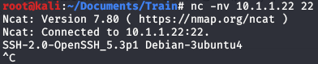

## python套接字

```python
>>> import socket
>>> bangrab = socket.socket(socket.AF_INET,socket.SOCK_STREAM)
>>> bangrab.connect(("10.1.1.22", 22))
b'SSH-2.0-OpenSSH_5.3p1 Debian-3ubuntu4\r\n'
>>> bangrab.recv(4096)
>>> bangrab.close()
```

+ `AF_INET`用于表示套接字使用IPv4地址
+ `SOCK_STREAM`用于表示套接字使用TCP传输

编写脚本获取多个端口服务信息

```python
#!/usr/bin/python

import socket
import select
import sys

if len(sys.argv) != 4:
    print("Usage - ./grab_banner.py [Target-IP] [First Port] [Last Port]")
    print("Example - ./grab_banner.py 10.1.1.22 1 100")
    print("Example will grab banners for TCP ports 1 through 100 10.1.1.22")
    sys.exit()

ip = sys.argv[1]
beg = int(sys.argv[2])
end = int(sys.argv[3])
for port in range(beg, end):
    try:
        soc = socket.socket(socket.AF_INET, socket.SOCK_STREAM)
        soc.connect((ip, port))
        ready = select.select([soc],[],[],1)
        if ready[0]:
            print("TCP Port {0} - {1}".format(port,soc.recv(4096)))
            soc.close()
    except Exception as e:
        pass
```

Python的select()方法直接调用操作系统的IO接口，它监控sockets,open files, and  pipes(所有带fileno()方法的文件句柄)何时变成readable 和writeable,  或者通信错误，select()使得同时监控多个连接变的简单，并且这比写一个长循环来等待和监控多客户端连接要高效，因为select直接通过操作系统提供的C的网络接口进行操作，而不是通过Python的解释器。

脚本中select 对象被创建,并赋给了变量 ready 。这个对象被传入了 4 个参数,包括读取列表,写入列表,异常列表,和定义超时秒数的整数值。

## dmitry

Dmitry可以用于对 150 个常用服务的端口执行快速的 TCP 端口扫描。

`dmitry -p 10.1.1.22` 对150个常用TCP端口进行扫描

`dmitry -pb 10.1.1.22` 在尝试连接这 150 个端口时,让 Dmitry 抓取任何可用的特征。

wireshark抓包看到dmitry对1到149端口进行了隐匿扫描。

## nmap

### NSE

使用脚本获取服务信息

`nmap -sT 10.1.1.22 -p 22 --script=banner`

### -sV

发送特定探测封包，获取服务信息

`nmap -sV 10.1.1.22 -p 80`

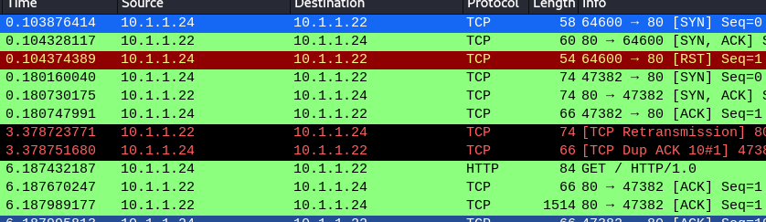

`nmap -sV 10.1.1.22 -p 22`

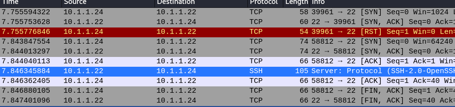

感觉`-sV`比使用banner脚本能获取更全面的服务信息

### -O

`nmap -O 10.1.1.22`

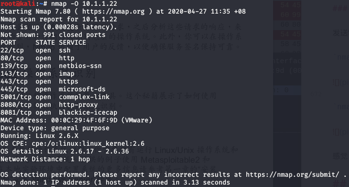

wireshark抓包，看到大量TCP-SYN请求，在wireshark中过滤`ip.addr == 10.1.1.22 and tcp.seq > 1`，发现没有数据。猜测nmap通过分析tcp开放端口以及连接响应来分析目标主机的操作系统。

### 防火墙识别

| SYN    | ACK  | 状态                              |
| ------ | ---- | --------------------------------- |
| 无响应 | RST  | 防火墙禁止连入，过滤进入的SYN封包 |
| SYN_ACK/RST | 无响应| 防火墙禁止连出 |
| SYN_ACK/RST | RST | 防火墙无过滤 |
| 无响应 | 无响应 | 防火墙过滤连入连出 |

`nmap -sA 10.1.1.21 -p 80`通过wireshark抓包分析，nmap仅发送ACK封包，若响应RST封包，则可知防火墙未过滤。

## scapy

**操作系统识别**

Windows 和 Linux/Unix 操作系统拥有不同的 TTL 默认起始值，windows的TTL默认起始值为128，Linux/Unix的TTL默认起始值为64（也一些基于 Unix 的系统会的 TTL 默认起始值为 225）。

`rep=sr1(IP(dst='192.168.2.105')/ICMP())`

**防火墙识别**

| SYN    | ACK  | 状态                              |
| ------ | ---- | --------------------------------- |
| 无响应 | RST  | 防火墙禁止连入，过滤进入的SYN封包 |
| SYN_ACK/RST | 无响应| 防火墙禁止连出 |
| SYN_ACK/RST | RST | 防火墙无过滤 |
| 无响应 | 无响应 | 防火墙过滤连入连出 |


## snmp

`snmpwalk 10.1.1.23 -c public -v 1`

`snmp-check 10.1.1.23 -c public -v 1`

## metasploit

```
msf5 > use auxiliary/scanner/portscan/ack
msf5 auxiliary(scanner/portscan/ack) > set rhosts 10.1.1.21
msf5 auxiliary(scanner/portscan/ack) > set threads 20
msf5 auxiliary(scanner/portscan/ack) > set ports 80
msf5 auxiliary(scanner/portscan/ack) > run
```

原理与`nmap -sA`一样，仅发送ACK封包，若响应RST封包，则可知防火墙未过滤。

# 漏洞扫描

## nmap脚本

nmap的全部脚本记录在/usr/share/nmap/scripts/script.db，script.db是一个简单的索引文件，显示每个NSE脚本的文件名及其所属类别，这些类别是标准化的，可以对特定类型的脚本进行grep。漏洞扫描类型的脚本的类别名称是vuln.

从NMAP 6.49beta6开始，smb-check-vulns.nse脚本被取消了。它被分为smb-vuln-conficker、•smb-vuln-cve2009-3103、smb-vuln-ms06-025、smb-vuln-ms07-029、smb-vuln-regsvc-dos、smb-vuln-ms08-067这六个脚本。

`nmap -p445 --script smb-vuln-ms17-010 10.1.1.26`

