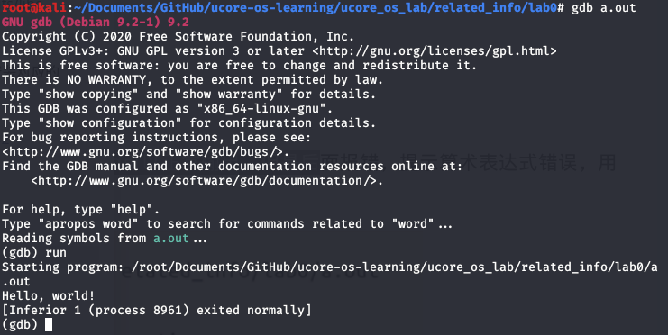

# 操作系统

## 操作系统的启动

bios->bootloader->OS

bios basic io system 将bootloader从硬盘的引导扇区加载到0x7c00

bootloader 将操作系统的代码和数据从硬盘加载到内存

系统调用：来源于应用程序，应用程序主动向操作系统发出服务请求，异步或同步事件

异常：来源于不亮的应用程序，非法指令或者其他坏的处理状态，同步事件

中断：来源于外设，设备请求操作系统提供支持，异步事件

+ 响应
  - 中断：持续的，对应用程序透明
  - 异常：杀死或重新执行导致异常的指令
  - 系统调用：


内存碎片问题

内存分区的动态分配

首次分配：为了分配n个字节的空间，使用第一个可用空闲块

优点：简单

缺点：容易产生外部碎片

最优适配：为了分配n个字节的空间，使用最小的可用空闲块

优点：最大多数小内存分配高效，简单

缺点：外部碎片，重新分配慢

最差适配：为了分配n个字节的空间，使用最大的可用空闲块

避免产生太多微小的碎片

优点：分配中等尺寸最好，

缺点：易于破坏大的空间块，重新分配慢

### 3.4  连续内存分配：压缩式与交换式碎片整理

压缩式：移动程序的内存块，让其相对集中

交换式：某程序需要更多的内存块，内存中没有额外的空间时，将某个处于等待状态的程序的内存块回收（其内存内容转移到硬盘）

## 4 非连续内存分配

### 4.1 分段

优点：程序物理地址非连续，更好的内存管理，允许共享代码

缺点：如何建立虚拟地址与物理地址之间的转换

分段管理

连续的逻辑地址空间映射到非连续的物理地址空间

段访问机制：访问内存需要2维信息，段号和段内偏移

硬件实现方案：

### 4.2 分页

页的大小固定

帧（frame） 物理内存被分为大小相同的帧 ，物理内存地址由帧号和偏移决定

页（page）逻辑地址空间被分为大小相同的页，逻辑地址由页号和页内偏移决定

页寻址机制：页表实现页地址到帧地址的转换

页内偏移到帧内偏移的转换？？？？？

### 4.3 页表-概述、TLB

每个运行的程序都有一个页表：会动态变化，PTBR：页表基址寄存器

页表项内容：标志位+帧号

缺点：

1. 访问一次内存单元需要两次内存访问：访问页表项、访问数据

2. 页表可能非常大

解决办法：缓存，间接访问

Translation Look-aside Buffer (TLB)缓存近期访问的页帧转换表项，如果TLB被命中，物理页号可以很快被获取，如果TLB未被命中，对应的表项被更新到TLB中

### 4.4 页表-二级，多级页表

二级页表，将页号拆分为两张表来表示，可以降低页表空间

多级页表

时间换空间，多几页表的访问时间增加

### 4.5 页表-反向页表

反向页表，以帧号为索引建立页表

优点：页表的大小只跟物理内存大小相关，与逻辑地址无关，占用空间减少

缺点：如何索引

解决方案：

1. 关联内存

2. 基于hash查找的方案

   利用hash将大量的页号放入不同的桶内（即hash值相同的页号属于同一个筒），桶内的页号采用链表的方式存储，hash表中存储着不同桶内链表的头节点。根据页号对应的hash值在hash表中找到头节点，判断进程ID，如果不是当前进程的ID，转到下一个节点，同样判断PID。

### 5.1 虚拟内存的起因

registers 1nsec, <1kb

cache  2nsec,1MB

main memory 10nsec 64~512MB

magnetic disk 10msec, 5~50G

magnetic tape

如果程序太大，可以有以下技术：

+ 手动的覆盖（overlay），只把需要的指令和数据保存在内存中
+ 自动的交换（swapping），把暂时不执行的程序放到硬盘
+ 自动的虚拟存储技术

### 5.2 覆盖技术

把程序划分为相对独立的不同模块，不同模块之间没有调用关系，当然需要一个管理模块。

缺点：增加编程复杂度，内存与外存交互需要时间

### 5.3 交换技术

将暂时不运行的程序送到外存，从而获得空闲内存空间

需要解决的问题

+ 交换时机的确定，只有当内存空间不足时换出
+ 交换区的大小，
+ 程序换入时的重定位，

### 5.4 虚存技术

程序的局部性原理：程序在执行过程中的较短时间内，所执行的指定地址和指令的操作数地址分别局限于一定区域。

+ 在加载程序时，不必将其全部加载到内存中，只需将当前需要执行的部分页面加载到内存中
+ 在程序执行过程中，需要的指令或数据尚未在内存中（成为缺页活缺段），将相应页面加载到内存中，继续执行；
+ 另一方面，内存空间不足时，操作系统将暂时不使用的页面调出内存，从而腾出空间加载需要的指令和数据。

虚拟内存基本特征

+ 大的用户空间：
+ 部分交换
+ 不连续性：物理内存分配不连续，虚拟地址空间使用的不连续

虚拟页式内存管理

### 5.5 虚存技术

在页式存储管理的基础上，增加请求调页和页面置换功能。

页表项增加几个标识位：

+ 驻留位，
+ 保护位：读？写？执行？
+ 修改位：是否被写过（与硬盘中备份是否一致）
+ 访问位：是否被访问

缺页中断

1. 内存中是否有空闲物理页面，有则分配物理页帧，执行第4步；否则，执行第2步；
2. 采用某种页面置换算法，如果该页在内存期间被修改了，则需把它写回外存；
3. 将上一步被换出的页面的驻留位修改为0
4. 将需要的页面写入空闲页面

后备存储

虚拟内存性能

有效存储器访问时间EAT：内存访问时间\*页表命中几率+页中断处理时间\*页中断几率

内存访问时间：10ns

硬盘访问时间：5ms

页中断几率：p

dirty page几率：q（将页面换出的几率）

EAT = 10(1-p)+5000000p+5000000pq

### 6.1 最优页面置换算法

缺页中断发生，需要调入新的页面而内存已满，选择内存中那个物理页面被置换。

尽量减少页面的换进换出

最优页面置换算法

基本思路：当一个缺页中断发生时，计算内存中每一个页面的下一次访问等待时间，选择等待时间最长的那个，作为被置换的页面。

理想情况，无法实现。可以作为性能评价的依据。 

### 6.2 先进先出算法

First-In First-Out

基本思路：选择在内存中驻留时间最长的页面并淘汰之。系统维护一个链表，记录了内存中的页面逻辑，链表首节点驻留时间最长。发生缺页中断时，将链表首页面换出，并将新的页面添加到链表末尾。

性能较差，换出的页面可能是经常被访问的，并有**belady现象，FIFO算法很少单独使用

### 6.3 最近最久未使用算法

Least Recently Used, LRU

基本思路：选择最久未被使用的页面，并换出

依据程序局部性原理。

实现方法

+ 系统维护一个链表，每一次访问内存，将被访问页面添加到链表首部，再遍历链表，查找刚刚访问的页面，若有，将其从链表中摘下来。当发生缺页中断时，将链表末尾的页面换出；
+ 系统维护一个堆栈，每一次访问内存，将被访问页面压入堆栈，再遍历堆栈，查找刚刚访问的页面，若有则抽出。当要换出页面时，总是选择栈底页面。


### 6.4 时钟页面置换算法

基本思路：

+ 需要使用页表项中的访问位。
+ 系统维持一个内存页面的环形链表，链表中每个节点包含页表的访问位。
+ 发生缺页中断时，指针遍历环形链表，若访问位为1，将其置0并访问下一节点，直到找到访问位为0的节点，将其换出，指针指向被换入页面的下一节点。

### 6.5 二次机会法

dirty bit 修改位

Enhanced Clock algorithm 二次机会法

同时使用修改位和访问位指导换入换出，

| 访问位  修改位 | -->  | 访问位 修改位 |
| -------------- | ---- | ------------- |
| 0 0            |      | 换出          |
| 0 1            |      | 0 0           |
| 1 0            |      | 0 0           |
| 1 1            |      | 0 1           |


### 6.6 最不常用算法

Least Frequently Used LFU

基本思路：将访问次数最少的页面换出

### 6.7 Belady现象、LRU、FIFO、CLOCK

belady现象：在采用FIFO算法时，有时会出现分配的物理页面数增加，缺页率反而提高的异常现象。

原因：

### 6.8 局部页面替换算法的问题、工作集模型

操作系统中同时运行多个程序，每个程序在不同时期需要的内存是动态的

工作集模型

如果局部性原理不成立，各种页面置换算法没有区别

工作集working set，一个进程当前正在使用的逻辑页面的集合，可以用二元函数W(t, \delta)表示一段时间内访问页面的集合

常驻集，当前时刻，进程实际驻留内存中的页面集合

### 6.9 两个全局页面置换算法

工作集页面置换算法

缺页中断时，替换内存中不在工作集中的页面，同时，随着时间推移，不在工作集中的页面被换出。值得注意的是工作集时刻窗口是小于物理内存大小的

基于缺页率页面置换算法

缺页率：缺页次数/内存访问次数，影响因子：算法、物理页面数目、页面本身大小、程序的编写方法

缺页中断时，记录最近两次缺页中断的时间间隔，间隔过大，将最近两次缺页中断时刻内没有被访问的内存页面从工作集中换出；间隔过小，将缺失页添加到工作集中

### 6.10 抖动问题

平均缺页时间

内存大小

## 7 进程

### 7.1 进程的定义

进程：一个具有一定独立功能的程序在一个数据集合上的一次动态指定过程

### 7.2 进程的组成

进程包括：代码、数据、寄存器、堆、栈

一个程序可对应多个进程；一个进程可能被多个程序调用

进程是动态的，程序是静态的

### 7.3 进程的特点

+ 动态性：动态创建、结束

+ 并发性：独立调度并占用处理机运行；
  - 并发：进程切换实现一段时间内多个程序运行
  - 并行：多个cpu实现同一时刻多个进程运行

+ 独立性：不同进程互不影响
+ 制约性：访问共享数据或进程间同步产生制约。

进程控制块，描述进程的数据结构 PCB

### 7.4 进程控制结构

OS管理控制进程运行所用的信息集合，PCB是进程存在的唯一标识

PCB内容

1. 进程标识信息，进程的标识，父进程标识，用户标识
2. 处理器状态信息
   + 用户可见寄存器
   + 控制和状态寄存器
   + 栈指针
3. 进程控制信息
   + 调度和状态信息
   + 进程间通信信息
   + 存储管理信息
   + 进程所用的资源
   + 有关数据结构连接信息

PCB组织方式

+ 链表，同一状态的进程其PCB成一链表，不同的状态对应不同的链表，如就绪链表、阻塞链表
+ 索引表，同一状态的进程归入一个索引表，如就绪索引表、阻塞索引表

### 7.5 进程的生命期管理

进程创建的3个事件

+ 系统初始化，创建init进程
+ 用户请求
+ 正在运行的进程执行进程创建的系统调用

进程运行，内核选择一个就绪进程，让它占用处理器

进程等待，进程只能自己阻塞自己，因为只有它自己知道何时需要等待

+ 请求等待系统服务，无法马上完成
+ 启动某种操作，等待其他进程
+ 需要的数据没有到达

进程唤醒，进程只能被别的进程或操作系统唤醒，

+ 被阻塞进程需要的资源被满足
+ 等待的事件到达
+ 该进程被插入PCB就绪队列

进程结束，有4情形

+ 正常退出、自愿
+ 错误退出、自愿
+ 致命错误、被强制
+ 被其他进程所杀、被强制

### 7.6 进程状态变化模型

进程的三种基本状态：运行、就绪、等待

### 7.7 进程挂起

进程挂起，意味着进程没有占用内存空间，处在挂起状态的进程映像在硬盘

+ 阻塞挂起状态，进程在外村并等待某事件的出现
+ 就绪挂起状态，进程在外村，进入内存即可运行

阻塞到阻塞挂起，优先挂起

就绪到就绪挂起，

运行到就绪挂起

阻塞挂起到就绪挂起

就绪挂起到就绪，没有就绪进程或挂起就绪进程优先级高于就绪进程时，进行这种转换

阻塞挂起到阻塞，当一个进程释放足够内存时，系统会把一个高优先级阻塞挂起进程转换为阻塞进程

操作系统管理进程的方法：

状态队列：就绪队列、阻塞队列

就绪队列可能有多个，同一优先级的进程属于同一队列

阻塞队列也有多个，一个等待事件对应一个阻塞队列，对应的事件到达时，需求得到满足的进程进入就绪队列

### 7.8 为什么使用线程

线程：更小的能独立运行的基本单位

多进程的问题：进程间通信？维护进程的开销？

### 7.9 什么是线程

线程：进程中的一条执行流程。

进程被拆分为：资源管理和执行流程（线程）

同一个进程的线程共享资源，如代码、数据、文件

线程有自己的线程控制块TCB，有独立的寄存器和栈空间

优点

+ 进程中可以包含多个线程
+ 各个线程可以并发执行
+ 各个线程共享地址空间和文件等资源

缺点

+ 一个线程崩溃，会导致其他线程崩溃

进程与线程对比

+ 进程是资源分配单位，线程是CPU调度单位
+ 进程是完整的资源平台，线程只是独占必要的资源
+ 线程同样具有就绪、阻塞和执行三种状态，同样有状态转换
+ 线程能减少并发执行的事件和空间开销
  + 线程创建时间短
  + 终止时间短
  + 线程切换时间短
  + 线程共享内存和资源，不需要通过内核进行通信

### 7.10 线程的实现

用户线程，操作系统看不到线程

+ 在用户空间实现线程机制，不依赖操作系统内核，由用户级线程库函数完成线程的创建、终止、同步、调度等
+ 操作系统不需要了解用户线程的存在
+ 缺点
  - 阻塞性的系统调用如何实现？一个线程被阻塞，整个进程被阻塞
  - 一个线程开始运行后，除非它主动交出CPU的使用权，否则进程中其他线程将无法运行
  - 由于时间片分配给进程，进程内各个线程获得的运行时间更少

内核线程，操作系统管理线程

+ 在操作系统内核中实现的线程机制，有操作系统完成线程的创建、终止、管理
+ 内核为何进程和线程的上下文信息，线程的创建、切换的开销较大
+ 同一个进程内，一个线程被阻塞，不影响其他内核线程
+ 时间片分配给线程，多线程的进程获得更多CPU时间
+ windows支持内核线程

轻量级进程

+ 内核支持的用户线程，一个进程可有一个或多个轻量级进程，每个轻量级进程由一个单独的内核线程来支持
+ Linux

### 7.11 上下文切换

停止当前运行进程（从运行状态改变为其他状态）并且调度其他进程

+ 保存进程的上下文，寄存器、栈指针
+ 能够之后恢复
+ 必须快速

### 7.12 进程控制-创建进程

### 7.13 进程控制-加载和执行进程

系统调用exec()加载程序取代当前执行的进程

fork() 创建子进程

vfork()

copy on write

### 7.14 进程控制-等待和终止进程

wait()系统调用 被父进程用来等待子进程的结束。

子进程自己无法回收内核中的PCB，父进程完成回收子进程的资源

wait()

+ 是父进程睡眠等待子进程的结果
+ 当子进程调用exit()时，操作系统解锁父进程，并通过exit()传递的返回值作为wait()调用的结果（联通子进程的pid）

当子进程执行完exit()，且内核中子进程的PCB未被回收（即父进程的wait()未执行完），子进程进入僵尸状态。

exit()

+ 将这个程序的“结果”作为一个参数
+ 关闭所有文件、连接等
+ 释放内存
+ 释放大部分支持进程的操作系统结构
+ 检查父进程是否存活
  - 是，保留结果知道父进程需要它，此时子进程没有真正死亡，进入僵尸状态
  - 否，释放所有数据结构，子进程死亡
+ 清理所有等待的僵尸进程

## 8 调度

### 8.1 背景介绍

上下文切换

+ 切换CPU当前任务，从一个进程/线程切换到另一个
+ 保存当前进程/线程的上下文（CPU状态）
+ 读取下一个进程/线程的上下文

CPU调度

+ 从就绪队列中挑选一个进程/线程作为CPU将要执行的进程/线程
+ 调度程序：挑选进程/线程的内核函数

什么时候调度？进程状态切换时发生调度

内核运行调度程序的条件（二选一）

+ 一个进程从运行状态切换到等待状态
+ 一个进程被终结

不可抢占：调度程序必须等待事件结束

可以抢占：

+ 调度程序在中断后执行
+ 当前进程从运行切换到就绪，或一个进程从等待切换到就绪
+ 当前运行的进程可以被换出

抢占与非抢占，分为用户态和内核态两种情形

### 8.2 调度原则

CPU使用率：CPU处于忙状态的占比

吞吐率：单位时间内完成的进程数量

周转时间：一个进程从初始化到结束，包括等待时间所花费的时间

等待时间：进程在就绪队列中的时间

响应时间：从一个请求被提交到第一次响应所花费的时间

公平的定义：确保每个进程公平地得到处理器的服务

### 8.3 调度算法1

**First come first serverd 先来先服务**

根据进程的先后顺序，顺序执行队列中的进程

优点

+ 简单

缺点

+ 平均等待时间波动大

**短进程优先**

选择下一个执行时间最短的进程，可以是抢占式或非抢占

抢占式：新来的进程比正在执行的进程的剩余时间短，执行调度算法

优点：

+ 平均等待时间最短

缺点：

+ 连续的短任务流会是长任务饥饿
+ 需要预知未来

预估执行时间：

$$
\tau_{n+1}=\alpha t_n+(1-\alpha)\tau_n
$$

$$
\tau_n 预估的CPU执行时间
$$

$$
t_n 第n个时间间隔CPU执行时间
$$

**最高响应比优先**

综合考虑进程的等待时间和执行时间

不可抢占

**轮询 round robin**

+ 额外的上下文切换
+ 设置时间片大小 经验值0.001s
+ 目标：选择合适的时间片，维持上下文切换开销处于1%以内

多级反馈队列

+ 就绪进程划分出多个独立队列，如，前台（交互）、后台（批处理）
+ 每个队列拥有自己的调度策略，如，前台（RR）、后台（FCFS）
+ 调度必须在队列之间进行
+ 进程可以在不同队列中移动
+ 时间片大小随着优先级级别增加而增加？？？？？
+ 如果任务在当前的时间片内没有完成，则降到下一个优先级
+ 优点：CPU密集型任务的优先级下降的很快，I/O密集型任务停留在高优先级

公平共享调度FSS

<<<<<<< HEAD
### 8.5 实时调度

面向实时系统，工业控制领域

硬实时系统，在确定的时间内必须完成任务

软实时系统，重要的进程优先级更高，尽量完成，非必须

静态优先级调度，任务执行之前确定优先级，按优先级先后顺序执行

动态优先级调度，任务优先级随着执行动态调整

RM 速率单调调度

EDF 最早期限调度

+ deadline越早优先级越高

### 8.6 多处理器调度与优先级翻转

多处理器CPU调度更加复杂

+ 多个相同的单处理器组成一个多处理器
+ 负载均衡

对称多处理器

优先级翻转

+ 可以发生于任何基于优先级的可抢占的调度机制
+ 优先级反转的持续时间取决于其他不相关任务的不可预测的行为
+ 当系统内的环境强制高优先级任务等待低优先级任务时发生
+ 解决办法：
  - 优先级继承
  - 资源优先级


## 9 同步

### 9.1 背景

独立的线程

+ 不和其他线程共享资源

+ 确定性
+ 可重现
+ 调度顺序不重要

合作线程

原子操作

### 9.2 一些概念

原子操作，一次不存在任何中断或者失败的执行

临界区 critical section，进程中一段需要访问共享资源并且当另一个进程处于相应代码区域时便不会被执行的代码区域

互斥 mutual exclusion，当一个进程处于临界区并访问资源时，没有其他进程会处于临界区并且访问任何相同的共享资源

死锁 dead lock，两个以上的进程，在相互等待完成特定任务，而最终没有将自身任务进行下去

饥饿 starvation，一个可执行的进程被调度器持续忽略

### 9.3  一些概念

锁 lock，加上保护性装置

解锁 unlock

死锁 dead lock 

标签方案无法解决问题

### 9.4 一些概念

### 9.5 临界区

互斥，同一时刻临界区中最多存在一个线程

前进，如果一个线程想要进入临界区，那么它最终会成功

有限等待，如果一个线程处于临界区入口，其他线程进入临界区的时间是有限的

无忙等待，如果一个线程在等待进入临界区，那么它可以在进入之前被挂起

### 9.6 硬件终端

+ 进入临界区，禁用硬件中断
+ 离开临界区，开启中断
+ 没有中断，就没有上下文切换，就不存在并发

缺点：

+ 一旦中断被禁用，整个系统都无法响应其他事件
+ 临界区可能任意长
+ 多核处理器不适用

### 9.7 基于软件的解决方法

使用两个共享数据项

`int turn;`

`boolean flag[]`

 ```c++
//peterson
do
{
	flag[i] = true;
	turn = j;
	while(flag[j] && turn == j);
	
	CRITICAL SECTION
	flag[i] = false;
	REMAINDER SECTION
}while(true)
 ```

peterson算法是一个谦让式的算法，不谦让是否可以？？？

peterson算法需要原子的LOAD和STORE指令

Eisenberg and McGuire算法，多个进程互斥

Bakery算法

### 9.8 更高级的抽象

锁是一个抽象的收据结构

+ `Lock::aquire()`
+ `Lock::release()`

Test-and-Set，原子操作

+ 读内存，返回这个值
+ 测试是否为1
+ 设置为1

交换，交换内存中的两个值，原子操作

忙等

## 10 信号量

### 10.1 背景

### 10.2 信号量

抽象数据类型

+ 一个整形sem，两个原子操作
+ P()，sem减1，如果sem<0，等待，否则继续
+ V()，sem加1，如果sem<=0，唤醒一个等待的P

信号量类似铁路

Dijkstra

+ V，荷兰语增加
+ P，荷兰语减少

### 10.3 信号量的使用

信号量是整数

信号量时被保护的变量

+ 初始化完成后，改变信号量值得办法是P和V
+ 操作必须是原子

 P可以被阻塞，V不会被阻塞

两种类型信号量

+ 二进制信号量，0，1
+ 计数信号量，任意非负值

两种用途

+ 互斥
+ 条件同步

二进制信号量实现互斥

二进制信号量实现调度约束

一个进程等待另一个进程处理事情

+ 同一时刻只能有一个线程操作缓冲区 ，互斥
+ 当缓冲区为空时，消费者必须等待生产者，调度
+ 当缓冲区满，生产者必须等待消费者，调度

每个约束用一个单独的信号量

+ 二进制信号量 互斥
+ 计数信号量 空
+ 计数信号量 满

### 10.4 信号量的实现

### 10.5 管程

目的：分离互斥和条件同步的关注

什么是管程

+ 一个锁，指定临界区
+ 多个条件变量，有两个操作
  - wait() 释放锁，睡眠，等待条件满足
  - signal()唤醒等待者

### 10.6 经典同步问题

读者-写者问题

共享数据的访问

读者，不修改数据

写者，可以读 写

问题的约束：

+ 同一时刻允许多个读者，但只能有一个写者
+ 当没有写者时，读者可以访问数据
+ 当没有读者和写者时，写者可以修改数据
+ 任一时刻只能有一个线程操作共享数据

共享数据

+ 数据集
+ rcount 读者数量
+ 信号量 countmutex 1
+ 信号量 writemutex 1

```c++
//writer
sem_wait(writemutex);//P
write;
sem_post(writemutex);//v

```

```c++
//reader
sem_wait(countmutex)
if(rcount == 0)
	sem_wait(writemutex)
++rcount
sem_post(countmutex)

read;

sem_wait(countmutex);
--rcount;
if(rcount == 0)
	sem_post(writemutex);
sem_post(countmutex);
```

## 死锁

### 11.2 系统模型

资源分配图

进程请求资源：从进程指向资源的一个箭头；

资源分配到进程：从资源指向进程的一个箭头

发生死锁时意味着资源分配图中存在环路

反之，不一定

### 11.3 死锁特征

死锁出现的四个必要条件：

互斥，

持有并等待

无抢占

循环等待

### 11.4 死锁的处理办法

死锁预防：打破循环等待，对所有资源类型进行排序，并要求进程按照资源的顺序进行申请。

死锁避免：

### 11.6 银行家算法

### 11.7 死锁检测和死锁恢复

死锁检测，定期执行检测算法，开销大

死锁恢复，

### 11.8 进程间通信 IPC

信号，修改进程堆栈用于打断正在运行的程序

管道，父进程帮子进程建立通信管道

消息队列，没有相关性的两个进程之间进行通信

共享内存，快速方便，需要考虑同步问题

## 12 文件系统

### 12.1 介绍

### 12.2 基本概念

 文件系统：一种用于持久性存储的系统抽象
=======
实验代码https://github.com/jackwener/ucore-os-learning.git

## ucore-lab0

### 1.了解汇编

`gcc -S -m32 lab0_ex1.c`

gcc -S选项是为了生成汇编文件，-m32选项则是指定编译为32位应用程序,新生成了一个.s汇编文件。

```c
//lab0_ex1.c
int count=1;
int value=1;
int buf[10];
void main()
{
   asm(
        "cld \n\t"
        "rep \n\t"                                           
        "stosl"
        :
        : "c" (count), "a" (value) , "D" (buf[0])
        :
      );
}
```

编译为汇编代码：

```assembly
        .file   "lab0_ex1.c"
        .text
        .globl  count			;对变量的声明
        .data
        .align 4
        .type   count, @object
        .size   count, 4
count:
        .long   1
        .globl  value
        .align 4
        .type   value, @object
        .size   value, 4
value:
        .long   1
        .comm   buf,40,32
        .text
        .globl  main
        .type   main, @function
main:							;进入main函数部分，首先将要用的寄存器的值先压入堆栈，对数据进行保护，随后将相关的数据，count、value、buf存入寄存器
.LFB0:
        .cfi_startproc
        pushl   %ebp			;保存栈底指针
        .cfi_def_cfa_offset 8
        .cfi_offset 5, -8
        movl    %esp, %ebp		;将esp赋值给ebp
        .cfi_def_cfa_register 5
        pushl   %edi
        pushl   %esi
        pushl   %ebx
        .cfi_offset 7, -12
        .cfi_offset 6, -16
        .cfi_offset 3, -20
        call    __x86.get_pc_thunk.ax
        addl    $_GLOBAL_OFFSET_TABLE_, %eax
        movl    count@GOTOFF(%eax), %edx
        movl    value@GOTOFF(%eax), %ebx
        movl    buf@GOT(%eax), %eax
        movl    (%eax), %esi
        movl    %edx, %ecx
        movl    %ebx, %eax
        movl    %esi, %edi
#APP
# 6 "lab0_ex1.c" 1				;进入操作阶段，首先cld命令对DF寄存器进行复位，决定接下来的操作向着内存增大的方向进行，随后rep表示重复，再结合stosl命令就可以实现向buf中写上count个value值
        cld 
        rep 
        stosl					;
# 0 "" 2
#NO_APP
        nop
        popl    %ebx
        .cfi_restore 3
        popl    %esi
        .cfi_restore 6
        popl    %edi
        .cfi_restore 7
        popl    %ebp
        .cfi_restore 5
        .cfi_def_cfa 4, 4
        ret
        .cfi_endproc
.LFE0:
        .size   main, .-main
        .section        .text.__x86.get_pc_thunk.ax,"axG",@progbits,__x86.get_pc_thunk.ax,comdat
        .globl  __x86.get_pc_thunk.ax
        .hidden __x86.get_pc_thunk.ax
        .type   __x86.get_pc_thunk.ax, @function
__x86.get_pc_thunk.ax:
.LFB1:
        .cfi_startproc
        movl    (%esp), %eax
        ret
        .cfi_endproc
.LFE1:							;关于当前操作系统、使用的gcc编译器的注释说明
        .ident  "GCC: (Debian 9.3.0-15) 9.3.0"
        .section        .note.GNU-stack,"",@progbits
```

高级语言的栈是从高地址向低地址增长的。

ESP：栈指针寄存器(extended stack pointer)，其内存放着一个指针，该指针永远指向栈顶元素。

EBP：基址指针寄存器(extended base pointer)，其内存放着一个指针，该指针永远指向栈底元素。

通常情况下ESP是可变的，随着栈的生产而逐渐变小；而EBP寄存器是固定的，只有当函数的调用后，发生入栈操作而改变，栈底一般存储了上一个函数的EBP

CLD（Clear Direction Flag）清除方向标识位，是DF为0，用于设置EDI的增长方向。

STOSL指令相当于将EAX中的值保存到ES:EDI指向的地址中，若设置了EFLAGS中的方向位置位(即在STOSL指令前使用STD指令)则EDI自减4，否则(使用CLD指令)EDI自增4。

rep指令的目的是重复其上面的指令。ECX的值是重复的次数

### 2.用gdb调试

```c
//lab0_ex2.c
#include <stdio.h>
int
main(void)
{
    printf("Hello, world!\n");
    return 0;
}
```

`gcc -g -m32 lab0_ex2.c`

**错误**: fatal error: bits/libc-header-start.h: No such file or directory #include <bits/libc-header-start.h>

出现这个错误时，这多半是你所编译的项目是在64位机器上生成32位的项目，你需要安装对应的gcc 32位的库。使用multilib可以在64位的机器上产生32位的程序或者库文件。

`apt install gcc-multilib`进行完善安装，安装完成后重新执行`gcc -g -m32 lab0_ex2.c`，生成a.out。

使用gdb调试a.out`gdb a.out`，输入`run`，即可运行程序。



更改lab0_ex2.c

### 3.掌握指针和类型转换相关的C编程

```c
#include <stdio.h>

#define STS_IG32        0xE            // 32-bit Interrupt Gate
#define STS_TG32        0xF            // 32-bit Trap Gate

typedef unsigned uint32_t;

#define SETGATE(gate, istrap, sel, off, dpl) {            \
    (gate).gd_off_15_0 = (uint32_t)(off) & 0xffff;        \
    (gate).gd_ss = (sel);                                \
    (gate).gd_args = 0;                                    \
    (gate).gd_rsv1 = 0;                                    \
    (gate).gd_type = (istrap) ? STS_TG32 : STS_IG32;    \
    (gate).gd_s = 0;                                    \
    (gate).gd_dpl = (dpl);                                \
    (gate).gd_p = 1;                                    \
    (gate).gd_off_31_16 = (uint32_t)(off) >> 16;        \
}

 /* Gate descriptors for interrupts and traps */
 struct gatedesc {
    unsigned gd_off_15_0 : 16;        // low 16 bits of offset in segment
    unsigned gd_ss : 16;            // segment selector
    unsigned gd_args : 5;            // # args, 0 for interrupt/trap gates
    unsigned gd_rsv1 : 3;            // reserved(should be zero I guess)
    unsigned gd_type : 4;            // type(STS_{TG,IG32,TG32})
    unsigned gd_s : 1;                // must be 0 (system)
    unsigned gd_dpl : 2;            // descriptor(meaning new) privilege level
    unsigned gd_p : 1;                // Present
    unsigned gd_off_31_16 : 16;        // high bits of offset in segment
 };
 
int
main(void)
{
    unsigned before;
    unsigned intr;
    unsigned after;
    struct gatedesc gintr;
    
    intr=8;
    before=after=0;

    gintr=*((struct gatedesc *)&intr);
    SETGATE(gintr, 0,1,2,3);
    intr=*(unsigned *)&(gintr);
    printf("intr is 0x%x\n",intr);
    printf("gintr is 0x%llx\n",gintr);
    
    return 0;
}
```

结构体gatedesc的定义很规范，成员变量的大小精确到了比特。printf内的参数%llx功能是输出有符号64位16进制整数。

宏定义SETGATE用于设置结构体gatedesc的值。

编译

`gcc -g -m32 lab0_ex3.c 2>&1 | tee make.log`

代码中的 “2>&1”要拆开来看，对于& 1 更准确的说应该是文件描述符 1,而1标识标准输出，stdout。对于2  ，表示标准错误，stderr。所以2>&1  的意思就是将标准错误重定向到标准输出。tee命令用于读取标准输入的数据，并将其内容输出成文件，将错误日志保存到make.log方便后期查看

输出结果

```
intr is 0x10002
gd_off_15_0 is ox2
gintr is 0xee0000010002
```

### 4. 掌握通用链表结构相关的C编程

`gcc -g -m32 -I. lab0_ex4.c 2>&1|tee make.log`

不加参数`-I.`会报错`defs.h: No such file or directory`

通用链接结构的意义在于将对链表数据的操作与对链表指针的操作分开，定义单独的结构体处理链表指针的增、删、插操作，屏蔽了链表数据的类型。

## ucore-lab1

### x86启动顺序

+ 加电
  - 主板加电后初始化固件（固件是固化在芯片组上的程序），固件会启动CPU
  - CPU启动后会运行BIOS内部的程序，此时CPU工作模式为实模式，该模式下地址总线为20位
+ BIOS执行过程
  - CPU启动后大多数寄存器会被初始化为预定的值，除了CS寄存器的值改为0xFFFF，其他寄存器的值都为0，根据CS 和 IP的值就可以找到指令的物理地址0xFFFF:0x0000，也就是0xFFFF0
  - CPU就开始执行在这个位置开始执行，这里存放的一条无条件跳转指令JMP，跳转到BIOS的真正启动代码处。
  - BIOS首先先进行POST（Power－On Self Test，加电后自检）
  - BIOS 程序在执行一些必要的开机自检和初始化后，会将自己复制到从 0xA0000 开始的物理内存中并继续执行 
  - BIOS存放在ROM中，ROM与RAM的地址如何统一？？？
+ 搜索MBR
  - 将存储设备中的引导扇区读入物理内存 0x7C00 处，并跳转到 0x7C00 继续执行，从而将 CPU 交给引导扇区中的 Boot 程序。 
  - 主引导记录包含3部分：引导程序、硬盘分区表、结束标志字

CPU 启动后其大多数寄存器会被初始化为预定的值

启动地址 CS=F000H， EIP=0000FFF0H

实际地址：EIP=FFFF0000H+0000FFF0=FFFFFFF0H，这是BIOS的EPROM所在地

实模式

从BIOS到Bootloader

+ BIOS加载存储设备的第一个扇区的512字节到内存中0x7c00
+ 跳转到0x7c00的第一条指令开始执行

从Bootloader到OS

+ bootloader的工作：
  - 使能保护模式&段机制
  - 从硬盘上读取kernel in ELF格式的ucore kernel并放在内存中固定位置
  - 跳转到OS的入口点，这时控制权到了ucore OS
+ 段机制
  - CS 代码段
  - 段机制是一种映射关系
  - 段描述符表 GDT

### 练习三

bootloader从实模式切换到保护模式，需要做以下事情：

1. 开启A20门
2. 在内存中建立GDT表并初始化
3. 设置cr0寄存器的PE位为1，表示从实模式切换到保护模式

**开启A20门**

开启A20门有多种方法，下面介绍两种：

+ 操作键盘控制器
  - 等待8042 Input buffer为空
  - 发送Write 8042 Output Port （P2） 命令到8042 Input buffer
  - 等待8042 Input buffer为空
  - 将8042 Output Port（P2） 对应字节的第2位置1，然后写入8042 Input buffer
  ```asm
  seta20.1:
    inb $0x64, %al      # Wait for not busy(8042 input buffer empty).
    testb $0x2, %al
    jnz seta20.1
  
    movb $0xd1, %al     # 0xd1 -> port 0x64
    outb %al, $0x64     # 0xd1 means: write data to 8042's P2 port
  
  seta20.2:
    inb $0x64, %al      # Wait for not busy(8042 input buffer empty).
    testb $0x2, %al
    jnz seta20.2
    	
    movb $0xdf, %al     # 0xdf -> port 0x60
    outb %al, $0x60     # 0xdf=11011111,means set P2's A20 bit to 1
  ```

+ A20快速门，使用IO端口0x92处理A20信号线。

**初始化GDT表**
+ 段描述符
在Protected Mode下，对一个段的描述则包括3方面因素：【Base Address, Limit, Access】，它们加在一起被放在一个64-bit长的数据结构中，被称为段描述符。这种情况下，如果我们直接通过一个64-bit段描述符来引用一个段的时候，就必须使用一个64-bit长的段寄存器装入这个段描述符。
+ GDT
Intel为了保持向后兼容，将段寄存器仍然规定为16-bit，很明显，我们无法通过16-bit长度的段寄存器来直接引用64-bit的段描述符。解决的方法就是把这些长度为64-bit的段描述符放入一个数组中，而将段寄存器中的值作为下标索引来间接引用（事实上，是将段寄存器中的高13 -bit的内容作为索引）。这个全局的数组就是GDT。
GDT描述系统段，包括操作系统本身。整个系统中只有一个GDT（一个处理器对应一个），可以存放在内存的任何位置。 Intel使用一个48位的寄存器GDTR存储GDT的入口地址，使用`LGDT xxx`将GDT的入口地址装入GDTR。


+ 段选择子selector

  
>>>>>>> ba5096bf7d7f7da9532d5bf02cc083dcfbc8b249
